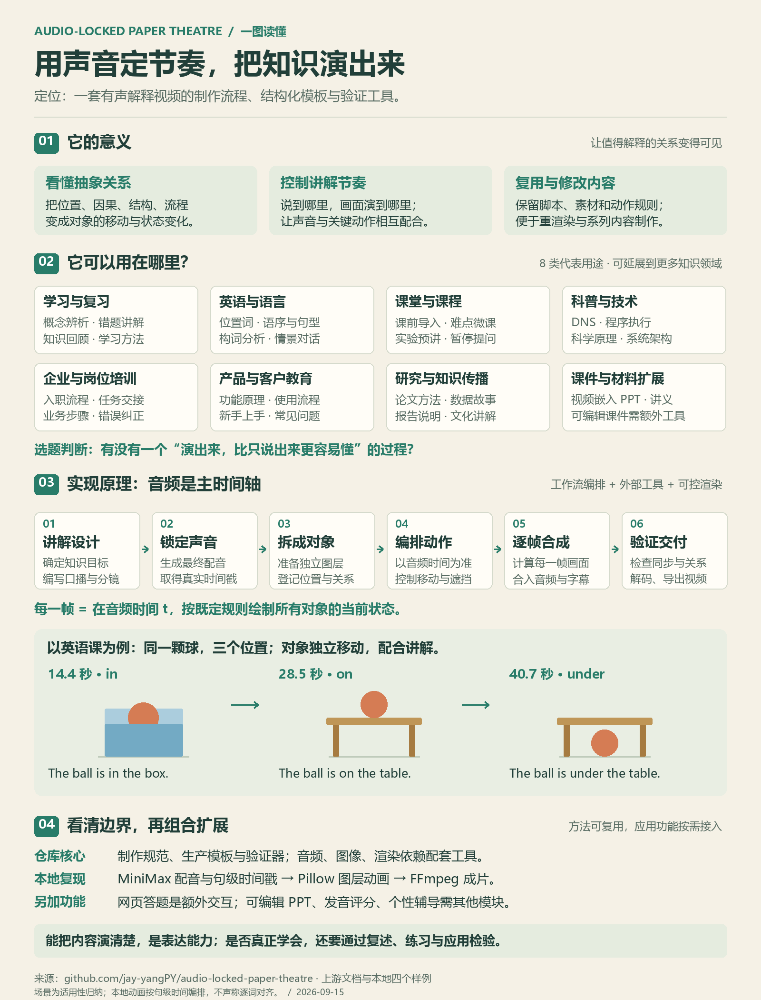
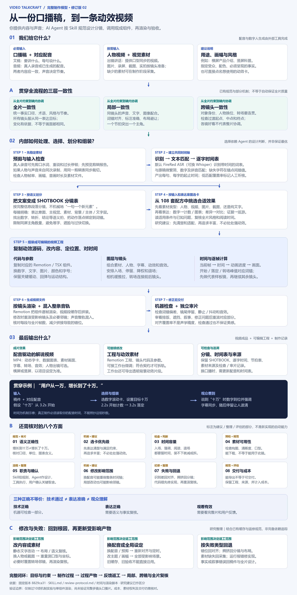

# GitHub 项目研究集

记录值得研究的优秀 GitHub 项目：理解设计思路、复现关键能力、沉淀实践笔记，并按需提供 Web 演示。

这里是研究总仓库。每个子项目独立保存源码实验、研究记录和图片；本页提供摘要和有序入口。

## 项目索引

编号是永久标识；展示顺序由 `projects.json` 的 `order` 决定。调整顺序不需要重命名目录。

<!-- PROJECT_INDEX:START -->
| 顺序 | 编号 | 项目 | 源库 | 能力摘要 | 状态 | 演示 |
| --- | --- | --- | --- | --- | --- | --- |
| 1 | 001 | [语音驱动纸艺剧场](projects/001-audio-locked-paper-theatre/README.md) | [audio\-locked\-paper\-theatre](https://github.com/jay-yangPY/audio-locked-paper-theatre) | 画板是舞台，物品是演员，代码是动作脚本，音频时间轴是演出节拍。用于培训视频制作、教学微课、科普与产品说明，附四个有声演示和场景指南。 | 已完成 | [在线演示](https://yydshly.github.io/0914_codex_project/001-audio-locked-paper-theatre/) |
| 2 | 002 | [Agent Skills Eval：Skill 能力校验引擎](projects/002-agent-skills-eval/README.md) | [agent\-skills\-eval](https://github.com/darkrishabh/agent-skills-eval) | 读取已编写的 Skill 与测试标准，自动调用模型、评分并对比有无 Skill 的效果，为校验能力 Skill 提供底层评测引擎。 | 已完成 | [在线演示](https://yydshly.github.io/0914_codex_project/002-agent-skills-eval/) |
| 3 | 003 | [Video TalkCraft：口播视频制作 Skill](projects/003-video-talkcraft/README.md) | [video\-talkcraft](https://github.com/Vincentwei1021/video-talkcraft) | 将口播稿、成品配音和素材组织为逐字同步的动效视频及可编辑工程；可复用到培训、产品讲解与系列口播，统一表达风格并支持局部修改。附输入准备、选卡原理与一致性指南。 | 已完成 | — |
<!-- PROJECT_INDEX:END -->

## 项目预览

<!-- PROJECT_PREVIEWS:START -->
### 001 · 语音驱动纸艺剧场

画板是舞台，物品是演员，代码是动作脚本，音频时间轴是演出节拍。用于培训视频制作、教学微课、科普与产品说明，附四个有声演示和场景指南。

#### 理解图一：音频驱动动画的实现架构

画板是舞台，物品是演员，代码是动作脚本，音频时间轴是演出节拍。看清时间戳、动作规则、图层与视频合成之间的关系。


#### 理解图二：意义与使用场景

从培训视频制作、英语教学、学科微课到技术科普与产品说明，直观了解适用场景、制作流程及扩展边界。



#### 演示效果


[研究记录](projects/001-audio-locked-paper-theatre/README.md) · [上游仓库](https://github.com/jay-yangPY/audio-locked-paper-theatre) · [在线演示](https://yydshly.github.io/0914_codex_project/001-audio-locked-paper-theatre/)

标签：培训视频 / 教学微课 / MiniMax / 音频时间轴 / 纸艺动画

### 002 · Agent Skills Eval：Skill 能力校验引擎

读取已编写的 Skill 与测试标准，自动调用模型、评分并对比有无 Skill 的效果，为校验能力 Skill 提供底层评测引擎。


[研究记录](projects/002-agent-skills-eval/README.md) · [上游仓库](https://github.com/darkrishabh/agent-skills-eval) · [在线演示](https://yydshly.github.io/0914_codex_project/002-agent-skills-eval/)

标签：Agent Skills / 自动评测 / LLM Judge / 可复现实验

### 003 · Video TalkCraft：口播视频制作 Skill

将口播稿、成品配音和素材组织为逐字同步的动效视频及可编辑工程；可复用到培训、产品讲解与系列口播，统一表达风格并支持局部修改。附输入准备、选卡原理与一致性指南。



[研究记录](projects/003-video-talkcraft/README.md) · [上游仓库](https://github.com/Vincentwei1021/video-talkcraft)

标签：口播视频 / Remotion / 音画同步 / 动效研究
<!-- PROJECT_PREVIEWS:END -->

## 开始研究

需要 Python 3.10 或更新版本，无第三方依赖。在仓库根目录运行：

```sh
python scripts/catalog.py add example-repo --name "示例项目" --repo "https://github.com/owner/example-repo" --summary "一句话说明值得研究的能力"
```

命令会分配下一个编号、创建研究目录、登记元信息并刷新首页。上述名称和地址仅为命令示例，请替换为真实项目。

1. 在新项目的 `README.md` 中填写研究目标、运行步骤和结论。
2. 在 `assets/` 放置截图，将相对仓库根目录的图片路径填入 `projects.json` 的 `cover`，并填写 `cover_alt`。
3. 修改摘要、状态、展示顺序或演示地址后，运行 `python scripts/catalog.py sync`。

## 仓库结构

```text
projects.json                 # 唯一项目登记表：编号、排序、摘要、图片、演示地址
projects/                     # 正式研究项目，使用 001-slug 格式
templates/project/            # 子项目模板，不占正式编号
docs/                         # 维护规范与部署说明
scripts/catalog.py            # 新建项目、生成首页、检查一致性
.github/workflows/check.yml   # 自动检查目录与首页索引
```

## 维护指南

- [项目组织与编号规则](docs/CONVENTIONS.md)
- [多个 Web 演示的部署约定](docs/DEPLOYMENT.md)
- [研究记录模板](templates/project/README.md)

## 来源与许可

各研究项目需注明上游仓库、研究版本及原始许可证。引入上游代码、图片或其他素材时保留其许可与署名；本仓库中的研究记录不改变上游项目的许可。
