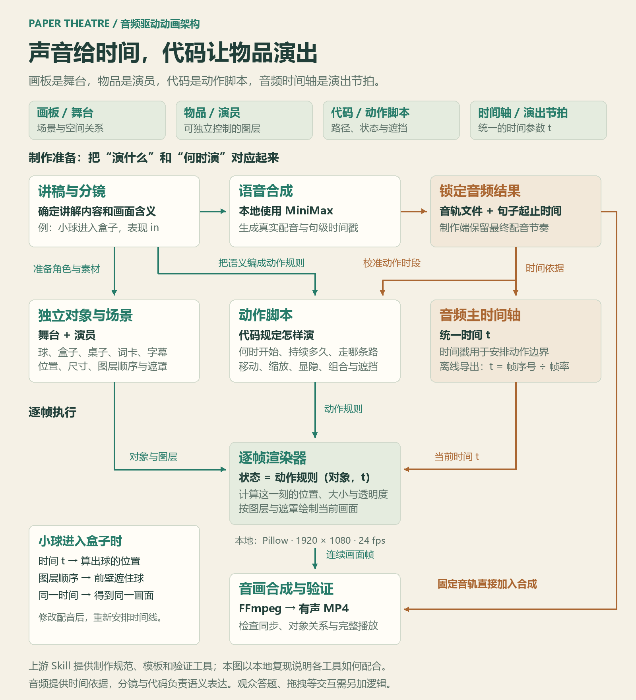
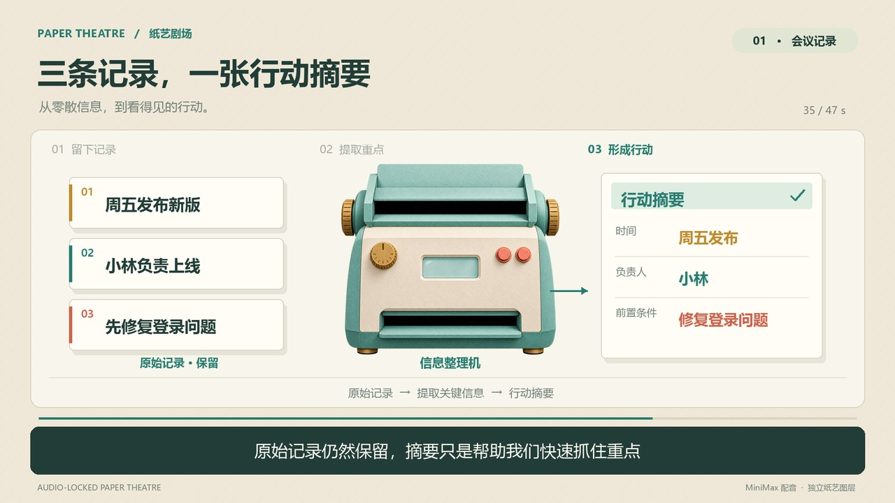

# 001 · 语音驱动纸艺剧场

**画板是舞台，物品是演员，代码是动作脚本，音频时间轴是演出节拍。**

研究如何用音频时间轴和代码控制独立对象的移动、遮挡、传递与组合，把知识和流程演出来。适用于培训视频制作、英语与学科微课、技术科普、产品说明和知识传播。

[在线阅读与观看演示](https://yydshly.github.io/0914_codex_project/001-audio-locked-paper-theatre/) · [英语微课堂](https://yydshly.github.io/0914_codex_project/001-audio-locked-paper-theatre/web/english.html)

## 我们形成的理解

音频提供时间依据，分镜与代码决定画面内容。每一帧根据当前音频时间计算对象的位置和状态，形成可以暂停、定位和重新渲染的动画。对象之间的互动是预先编排的演出；观众答题、拖拽或提问属于另加的交互逻辑。

上游提供制作流程、生产模板与验证工具；本地使用 MiniMax 句级时间戳、Pillow 图层渲染和 FFmpeg 合成，完成了会议记录、DNS、任务培训、英语位置词四个样例。英语页额外提供三道固定答案练习。

### 代表使用场景

| 场景 | 可以制作什么 |
| --- | --- |
| 培训视频制作 | 入职流程、任务交接、岗位步骤、标准操作说明与纠错案例 |
| 教学与个人学习 | 英语句型、概念辨析、难点微课、解题过程与复习材料 |
| 科普与技术解释 | DNS 查询、程序执行、系统架构、科学原理与因果过程 |
| 产品与知识传播 | 新手上手、功能说明、客户教育、论文方法与报告讲解 |
| 课件组合 | 在 PPT 中嵌入视频；可编辑 PPT、讲义、题库需要接入相应工具 |

选题关键：是否存在值得用对象变化展示的位置、步骤、因果或结构关系。教学成效需要通过复述、练习和迁移应用验证。

研究延伸：[可用场景全景：20 类、100 个候选用途，以及学习、教学与 PPT 的组合方式](notes/use-cases.md)。

[一图读懂：意义、使用场景与实现原理](assets/library-overview.png) · [可编辑 SVG](assets/library-overview.svg) · [网页查看](web/guide.html#overview)

## 音频驱动动画架构图

讲稿与分镜决定对象和动作规则；真实音频时间戳帮助校准动作时段。渲染器根据统一时间 t、动作规则与独立图层生成每一帧，再与固定音轨合成视频。



[查看高清架构图](assets/audio-animation-architecture.png) · [可编辑 SVG](assets/audio-animation-architecture.svg)

## 直接观看

### 四个有声样例

| 类型 | 内容 | 时长 | 入口 |
| --- | --- | --- | --- |
| 科普 | DNS 如何把网站名称解析成网络地址 | 61 秒 | [播放页](web/dns.html) · [MP4](demos/dns/output/demo.mp4) |
| 教学培训 | 把模糊需求变成可执行任务，含练习 | 74 秒 | [播放页](web/task-training.html) · [MP4](demos/task-training/output/demo.mp4) |
| 英语微课 | in / on / under，跟读与网页练习 | 89 秒 | [播放页](web/english.html) · [MP4](demos/english/output/demo.mp4) |
| 基础机制 | 会议记录形成行动摘要 | 47 秒 | [播放页](web/index.html) · [MP4](output/paper-theatre-demo.mp4) |

四段都使用 MiniMax 合成配音、句级时间戳和独立图层。查看[演示说明、复现步骤与素材提示](demos/README.md)。

### 基础样例：会议记录

- [本地播放页](web/index.html)：视频播放、四个章节跳转和素材下载。
- [完整 MP4](output/paper-theatre-demo.mp4)：47.04 秒，1920×1080，24 fps，H.264 + AAC，约 2.3 MB。
- [原始配音](assets/narration.mp3)：45.61 秒，MiniMax `speech-2.8-hd`，中文男声。
- [屏幕字幕](output/captions.srt) / [关键帧总览](output/contact-sheet.jpg) / [质量报告](output/qa-report.json)。



## 演示内容

这是一个自编的会议记录样例：

1. 周五发布新版。
2. 小林负责上线。
3. 上线前修复登录问题。

画面把三条记录整理成「时间 / 负责人 / 前置条件」，原始记录保留。机器和纸张均为视觉隐喻；摘要内容预先编写，本次没有连接实时摘要模型。

| 时间 | 画面行为 |
| --- | --- |
| 00–12 秒 | 三张独立记录卡随对应口播逐张进入 |
| 12–16 秒 | 卡片从并排布局收拢，展示信息尚未整理 |
| 16–20 秒 | 纸艺机器进入，记录副本依次送入上方插槽 |
| 20–25 秒 | 提取时间、负责人、前置条件，原文对象同步高亮 |
| 25–33 秒 | 摘要从下方出口出现，移至右侧并逐项强调 |
| 33–38 秒 | 保留左侧原始记录与右侧摘要 |
| 38–47 秒 | 展示从真实配音提取的波形，最后停稳 |

## 快速运行

环境：Python 3.10+、FFmpeg、ffprobe、Pillow、requests。当前绘制脚本使用 Windows 自带的微软雅黑；其他平台需修改 `src/render.py` 的字体路径。

在本子项目目录执行：

```sh
python -m pip install -r requirements.txt
python src/serve.py
```

打开 `http://127.0.0.1:8766/web/index.html`。播放服务器仅绑定本机，支持 HTTP 字节范围请求，确保视频拖动与章节跳转正常。

已有素材可以离线重新渲染，无需再次调用付费语音接口：

```sh
python src/render.py
python src/verify.py
```

只生成审核帧：

```sh
python src/render.py --frames-only
```

## 重新定制配音

文稿位于 `src/synthesize.py` 的 `LINES`；已有十二句分镜与渲染器一一对应。改变句数或故事结构，需要同时调整分镜代码。

复制 `.env.example` 为本地配置文件，填入 MiniMax 凭据，再指定路径：

```sh
python src/synthesize.py --env /path/to/.env.minimax
```

该调用会使用 MiniMax 账户额度。脚本拒绝覆盖已有的 `assets/narration.mp3`，避免误触发重复生成；如确实需要新配音，请先主动备份旧文件。配置文件与密钥不复制到输出，也不写入日志。

本次使用系统音色 `male-qn-jingying`，合成语速为 0.94。真实音轨生成后，视频制作端没有加速、拉伸或收紧停顿；仅在末尾追加约 1.43 秒静音停留。

## 场景总览与英语课堂

- [能力与场景网页](web/guide.html)：20 类、100 个可搜索候选用途，包含技术原理、学习、教学、PPT 组合方式和能力边界。
- [英语微课堂](web/english.html)：89 秒 MiniMax 中英双语讲解 in / on / under，带跟读停顿、章节定位和三道互动练习。
- [英语视频](demos/english/output/demo.mp4) · [课堂说明、素材提示与验证](demos/english/README.md)。

## 技术原理

```text
自编口播稿
  → MiniMax 语音合成 + 真实音频句级时间戳
  → 十二句时间线与字幕
  → 独立纸艺机器 / 卡片 / 摘要 / 目标框
  → 以音频时间为输入的确定性逐帧渲染
  → FFmpeg 合成为有声 MP4
  → 全片解码、音轨一致性与画面检查
```

- `src/synthesize.py`：调用 MiniMax，保存音轨、原始时间戳、无密钥请求记录和哈希。
- `src/render.py`：根据最终音频的时间戳控制对象进入、插槽遮挡、输出来源、文字与字幕。使用 Pillow 实现等价的程序化渲染，不依赖 Remotion。
- `src/verify.py`：检查成片编解码、分辨率、时长、黑屏、音频一致性、字幕时间和哈希。
- `src/serve.py`：支持视频定位的本地播放服务。
- `assets/timeline.json`：真实句级边界与画面时间线。
- `notes/asset-provenance.md`：素材来源、完整生图提示及许可说明。

句级边界来自 MiniMax 返回的数据；一句话内部的三步动作按导演编排细分，未声称逐词识别对齐。机器出口、入口采用固定几何位置与硬遮罩，不使用随机生成的视频运动。

## 验证结果与范围

- 全片 FFmpeg 解码通过，无黑屏片段。
- 原始配音 SHA-256 保持不变。
- 成片音轨与原配音在同一时间位置的相关系数为 0.999961，AAC 编码产生轻微差异。
- 十二条字幕没有重叠，字幕末尾位于真实配音范围内。
- 检查了 14 张关键帧，涵盖记录进入、布局收拢、机器输入、摘要输出及最终状态。
- 这是一个约 47 秒的机制样例，没有声称通过上游完整长片工作流的全部门禁或独立审核。
- 本次没有配乐、品牌尾片、发布平台操作或两种比例封面生产。

## 上游信息

| 项目 | 内容 |
| --- | --- |
| 上游仓库 | https://github.com/jay-yangPY/audio-locked-paper-theatre |
| 研究 Commit | `cb75aeea55b9eed0c299be1761810d8643a106c9` |
| 上游许可证 | MIT |
| 研究状态 | 已完成本地机制样例 |
| 开始日期 | 2026-09-15 |
| 在线部署 | [GitHub Pages](https://yydshly.github.io/0914_codex_project/001-audio-locked-paper-theatre/)；静态网页、MP4 与课堂练习 |

本项目借鉴上游的“音频主时间轴、独立对象、确定性后期、输出来源可追溯”方法，实验代码为本次编写，未复制上游的私有节目素材。MiniMax 接口参考：[同步语音合成文档](https://platform.minimaxi.com/docs/api-reference/speech-t2a-http)。

[返回总索引](../../README.md)
