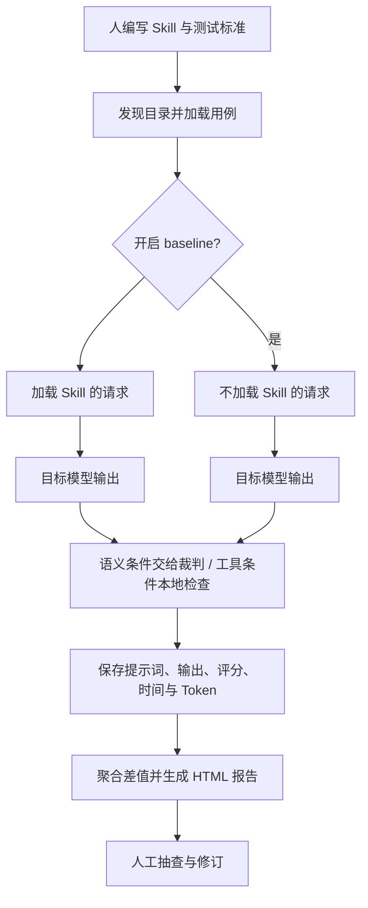

# 技术原理：把人工验收中的一部分变成自动评测

## 1. 四个角色

| 角色 | 负责什么 | 不会自动解决什么 |
| --- | --- | --- |
| 人 | 定义任务、选择样本、编写标准、抽查结果 | 标准不会凭空产生 |
| Skill | 给目标模型提供操作步骤和领域上下文 | 不是评测器本身 |
| 目标模型（target） | 根据任务和可选 Skill 生成回答或工具调用请求 | 默认没有真实工具执行环境 |
| 裁判模型（judge）与确定性检查程序 | 按给定条件评分 | 评分不等于事实自动得到验证 |

用户最初的理解可以表述为：“人工制定验收标准，把一部分逐条检查交给程序与 AI，人工保留抽查与最终判断。”这不是让 Skill 自己评判自己；只是 target 与 judge 允许配置为同一种模型。

## 2. 数据流



这是上下文注入、两组对照和自动评分的组合，不涉及模型训练。架构与运行顺序可在 [evaluate-skills.ts](../upstream/src/evaluate-skills.ts) 和 [run-eval.ts](../upstream/src/run-eval.ts) 中核对。

## 3. 逐层实现

### 加载层

[discover.ts](../upstream/src/discover.ts) 找到 Skill 目录；[skill.ts](../upstream/src/skill.ts) 解析 SKILL.md 的 YAML 头部，读取 evals/evals.json。严格校验主要包括名称格式、长度、父目录名称一致性和描述等字段。

参考资料仅收集 references/ 下的 .md / .mdx。脚本默认暴露名称、大小和 shebang 等信息，可选读取脚本文本；加载器不执行这些脚本。实际运行时直接组合已选 Skill 的上下文，未模拟多技能选择或按需逐步读取资料。

### 请求层

[run-eval.ts](../upstream/src/run-eval.ts) 把正文、参考资料和脚本信息包装为带标签的 system 内容。支持原生附件的自定义 Provider 可以收到附件对象；内置 Provider 不支持附件，文本内容会内联到 user 消息中。二进制文件会被跳过，文本默认有 64 KiB 读取限制，参见 [fs-utils.ts](../upstream/src/fs-utils.ts)。

**已确认的差异：**两组 prompt 和有效工具定义相同，但 evals[].files 仅在 with_skill 模式加载。故“同一任务提示词”不等于“同一完整任务输入”。详情见 E01/E02。

内置 [OpenAICompatibleProvider](../upstream/src/openai-compatible-provider.ts) 使用 /chat/completions，提取第一条响应的文本与 tool_calls；没有工具执行、工具返回消息或多轮规划循环。自定义 Provider 能扩展能力，但这些扩展不属于内置流程的已验证行为。

### 评分层

[grade.ts](../upstream/src/grade.ts) 提供两类检查：

- 自然语言 assertions：调用裁判，要求返回 JSON，逐条给出 passed 与 evidence。
- 工具 assertions：本地检查名称、次数、参数相等、包含或正则匹配，不需要裁判。

当自然语言断言为空但存在 expected_output 时，运行器将后者转为一条断言；已有断言时，不另外附上 expected_output。默认裁判提示词包含断言、模型输出和可选工具调用，原任务和输入文件不会自动加入。裁判因此依赖断言是否提供足够事实。

裁判 JSON 解析失败会重试一次；仍失败则相关断言失败。统计由程序重算，不信任裁判提供的 summary。不过，结果与条件按数组位置绑定，证据不足不会强制改判，见 E05/E07。

### 聚合与自动化层

[artifacts.ts](../upstream/src/artifacts.ts) 计算每组用例通过率、耗时和 Token 的均值、标准差及两组差值；[report.ts](../upstream/src/report.ts) 从本地产物生成内嵌样式的静态 HTML。

```text
单用例通过率 = 通过的检查条件数 / 检查条件总数
benchmark 通过率均值 = 各用例通过率的算术平均
两组差值 = with_skill 的均值 - without_skill 的均值
```

总报告与 SDK 汇总还使用“所有检查条件一起计算”的通过率；当每个用例条件数量不同，它与 benchmark 的用例均值会不同，见 E11。

耗时和 Token 统计来自目标模型响应，不包含裁判调用。不能将这些值当成整个评测任务的总成本。benchmark 的标准差也是不同用例间的分散程度，不能直接作为 Skill 提升的置信区间。

[cli.ts](../upstream/src/cli.ts) 根据有 Skill 一组的失败条件数量决定退出码，不检查增益是否大于零；--strict 是 Skill 格式校验，不是效果显著性校验。没有发现用例也可能退出成功，见 E12。

## 4. 可以借鉴的设计

1. **目标与裁判解耦**：同一套用例可以用于不同模型或自定义运行器。
2. **规则检查与语义检查结合**：工具参数能用程序验证时，不必再用模型猜测。
3. **保留中间证据**：失败时可以看提示词、输出和逐条判断，而不只看总分。
4. **静态报告与结构化数据并存**：适合本地研究，也方便接入其他报表系统。

这些设计的工程价值已通过流程测试得到支持；它们本身不保证选出的用例具有业务代表性。

## 来源

以上源码链接均指向本项目固定副本，文件内容由 SHA-256 校验。[上游固定版本](https://github.com/darkrishabh/agent-skills-eval/tree/b60eebe3c6edaa917a284e13b9b0e9fa00f1c957)与[来源清单](../upstream-source.json)可用于复查。研究没有验证 README 中关于外部规范“完全兼容”的全部声明。

[返回研究首页](../README.md)
