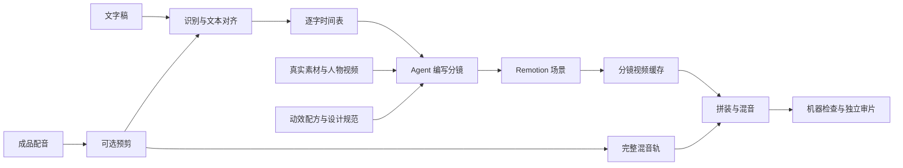

# 原理研究：从配音到可渲染工程

基准：`8829ca31fb8aeb1b850e85e47a7d7584c349bc4a`，2026-09-15。

## 架构分工

| 层 | 作用 | 本地证据 |
| --- | --- | --- |
| Agent 制作规范 | 理解稿件、分镜、选卡、实现与审片协调 | [SKILL.md](../upstream/SKILL.md) |
| 音频处理 | 预剪、对齐和时间契约转换 | [voice_trim.py](../upstream/scripts/voice_trim.py)、[timestamps_cpu.py](../upstream/scripts/timestamps_cpu.py)、[make_timing.py](../upstream/scripts/make_timing.py) |
| 视觉实现 | 动画组件、相机、旧主体降权 | [number-counter.tsx](../upstream/template/cards/number-counter.tsx)、[camera.tsx](../upstream/template/motion-systems/camera.tsx)、[life.tsx](../upstream/template/motion-systems/life.tsx) |
| 渲染与检查 | 分镜缓存、整条混音、检查 | [render_shots.mjs](../upstream/scripts/render_shots.mjs)、[beat_lint.py](../upstream/scripts/beat_lint.py) |
| 人工微调 | 多轨时间线、片段参数、工程预览 | [workbench/README.md](../upstream/workbench/README.md) |

## 1. 对齐不是单一模型完成的

**源码确认，核心逻辑已做控制实验。**

默认 FireRedASR2-CTC int8 经 sherpa-onnx 在 CPU 上输出 token 与时间；备用 faster-whisper 输出词级时间。稿件和词表各自展开为字符，统一繁简、全半角及数字写法；用无声调拼音容忍同音误识别。

`difflib.SequenceMatcher` 匹配文本段，把识别时间赋给稿件字符作为锚点。相对邻近锚点线性预期偏离超过 0.8 秒的点降级处理；没匹配上的字符用相邻锚点插值。多字词的内部时间也可能均分。

输出通常为 CJK 逐字、拉丁连续段合并 token。`make_timing.py` 再展开为与全文逐字符对应的时间表，标点用零时长。

`match`主要计中文锚点覆盖率，中文不足五字才退回全部字符；低于 0.90 标记听核。它不是声学置信度，也不是最终音画同步误差。英文缺失或全部时间一起错后两秒仍可得到 1.0，见 [实际实验](experiments.md)。

长音频默认按静音分为不超过约 75 秒的块，识别后加回块偏移，用于限制内存和输入长度。作者的真实录音精度与速度数据，本次没有加载模型复测。

## 2. 智能决策主要发生在分镜阶段

**流程文档确认，本次未运行完整长片制作。**

SHOTBOOK 记录每镜的表达意图、素材、背景/主体/文字层、语义拍、布局和选卡。`beats.json` 将动作落为“某句话的某个词、某个时刻”；规则要求从时间表查询，避免手敲近似秒数。

Agent 决定是用对比、数字、实拍还是截图，以及主次关系如何交接；动画组件提供现成的运动结构。复制组件后按本片修改颜色、字体和内容，而不是仅根据卡名重新猜一种动画。

文档口径有差异：README 将 B-roll/截图列为用户可选输入，而当前 SKILL 要求最终片至少包含实拍或图片。可理解为用户不必提供全部素材，但制作阶段仍须采集；不能承诺纯文字空背景就符合全部交付规则。

## 3. 动画是当前帧的函数

**源码确认；原始数字组件另做实际渲染。**

组件读取当前帧，以帧号除以 fps 得到时间，计算插值、缓动、位置、透明度或数字。示例：`value = lerp(0, target, easing(progress))`。当前帧即可决定画面，不需要从第零帧实时播放才能还原状态。

相机通过画面容器的 CSS 变换控制缩放、平移等。所谓“反 PPT”是运动与排版规范，当前默认偏向极缓推拉及旧主体让位；其余功能存在于代码中但可能默认关闭。不能把“七层”理解为每镜叠满七套动画，也不能把持续运动当成叙事优秀的证明。

## 4. 分镜缓存与整条音轨

**源码确认，本次未做多镜头性能测试。**

`render_shots.mjs` 按镜头生成无声段，段间可并行、段内单并发。变更后通过参数重渲本镜与受转场交叠影响的邻镜，再拼装已有缓存。

声音保持完整混音轨，最后一次混入，避免分段 AAC 编码的起始延迟累计。镜头边界统一按帧取整，并检查段帧数和总帧数。

增量有边界：主题、时间、字幕、相机等公共改变可能影响多镜；音轨缓存用素材、输入参数与时序文件指纹，藏在其他组件中的音量变化可能需强制刷新。不能把它等同于完备的依赖追踪构建系统。

## 5. 检查能证明什么

| 检查 | 能发现 | 不能单独保证 |
| --- | --- | --- |
| match | 文本锚点覆盖不足 | 声学时间准确、没有整体漂移 |
| beat_lint | 相对词表错位、镜尾停留不足 | 词表与真实录音是否一致 |
| motion_check | 按阈值及采样查静止/部分抖动 | 所有闪烁、构图美感、语义有效 |
| sfx_check | 音效能量与部分掩蔽指标 | 全部主观听感与艺术选择 |
| card_lint | 卡存在、与模板保持一定相似度 | 实际使用正确、画面完全保真 |
| 独立审片 | 布局、遮挡、叙事等判断 | 无需人工反馈的完美交付 |

本次仅运行对齐、时间转换、节拍检查及单组件渲染；其他检查为源码研究。

## 6. 工作台读取结构化工程

它管理 Project → Track → Clip。字幕、音效和镜头可以分轨，是源工程已经提供这些结构，并非从任意视频逆向识别得到。

promo 契约齐备的工程支持拆解；一般 `Main.tsx + scenes/` 工程支持预览和导出，但缺少拆解模块时相关按钮会禁用。改文字不自动生成新配音或新词锚，换稿须回到时间管线。

## 7. 一致性分为三个范围

- **全片一致性**：观点、事实口径、术语、人物身份和视觉语言持续一致；镜头可以变化，但不能把“注册用户”悄悄换成“活跃用户”。
- **局部一致性**：同一镜头里的声音、字幕、数字、素材和动效表达同一件事，关键动作落在对应词上，并有足够阅读时间。
- **跨镜头一致性**：前后镜头的主体、颜色含义、空间关系和声音衔接可理解；要检查完整过渡，不能只看两个静态端点。

上游通过共享配置、逐字时间表、分镜记录、检查脚本及审片规范覆盖其中一部分。共享配置有助于统一外观；事实含义、叙事连续性和观看体验仍需要判断。本研究尚未用完整多镜头成片验证这些要求。

## 8. 从单向流程到可修正的制作过程

技术检查通过，不等于表达正确，也不等于观众能理解。选卡应同时考虑表达目标、可用输入、时间容量和全片约束；完整优先级是本研究的整理，不是已实现的自动最优选卡算法。

修改稿件或配音后，要回到时间表与受影响的分镜；修改公共主题后，要检查所有受影响的镜头；局部缓存不能代替这种影响范围判断。失败也须按原因回到对齐、素材、实现或分镜阶段。

详细的八项约束、职责划分、变更影响表、失败回退及逐项证据见 [完整制作模型](production-model.md)。这份模型将现有机制和规范连接起来，同时明确研究建议，不能理解为库已具备完整自动依赖追踪或全自动质量评估。
