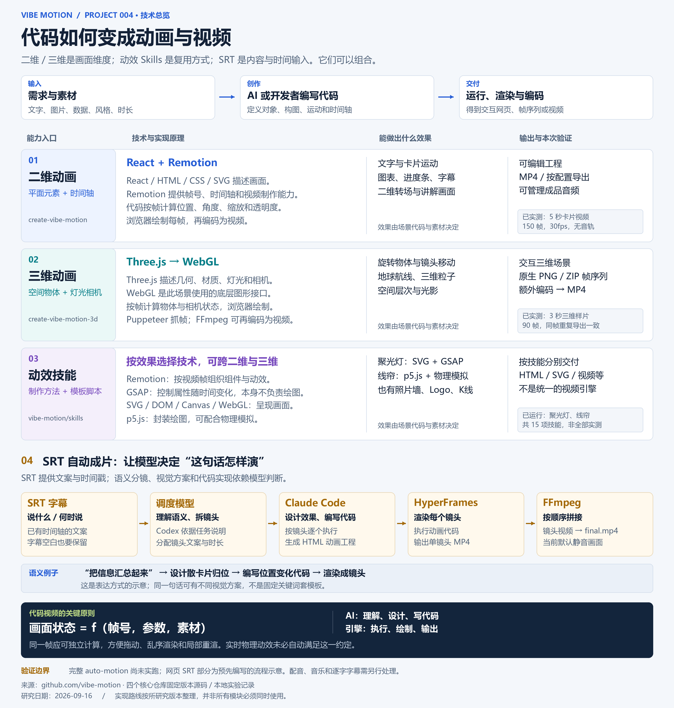
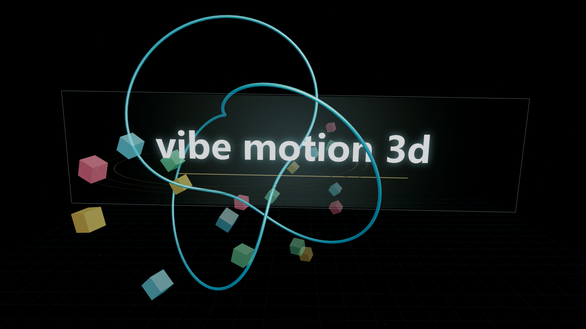

# 004 · Vibe Motion：AI 驱动的代码动画工具集

**核心意义：把 AI 编写代码与动画引擎连接，让动画成为可编辑、可复用、可批量渲染的工程。** 文案、节奏和场景都可以继续修改，同一套设计可以用于系列教学、产品讲解与数据展示。

Vibe Motion 是 GitHub 组织中的一组工具：二维与三维脚手架、15 个动画技能，以及从 SRT 字幕编排镜头的自动制作流程。模型负责理解需求和编写代码，动画引擎负责执行与渲染。

本次已完成四个核心仓库研究、二维与三维实际视频、两个动效示例，以及四分类研究网页。完整的 AI 自动成片和其余技能仍待专项验证。

[打开在线研究网页](https://yydshly.github.io/0914_codex_project/004-vibe-motion/) · [网页启动与打包](web/README.md) · [能力与架构](notes/architecture.md) · [15 项技能目录](notes/skills.md) · [实验记录](notes/experiments.md) · [来源与版本](notes/sources.md) · [播放三维示例](assets/demo-3d.mp4)

## 一图理解技术、效果与原理

[高清 PNG](assets/technology-map.png) · [可缩放 SVG](assets/technology-map.svg)



## 为什么值得研究

- **修改有落点**：文字、颜色、尺寸和时间轴可以通过参数调整；构图、转场和镜头运动可以直接修改代码，再重新渲染。
- **制作经验可以复用**：脚手架提供工程起点，Skills 保存动效做法与质量规则，便于同类内容沿用设计。
- **适合系列内容与自动化**：在模板、素材和渲染流程准备好之后，可批量替换内容，制作课程片段、产品功能说明或数据动画。
- **语义可以连接视觉表达**：SRT 中的“汇总信息”可以被模型设计成“散卡片聚合”；动画代码把这个视觉方案落实为逐帧画面。

这些价值依赖工程与审片流程。参数复用已有实测示例；批量生产质量、完整自动成片和全部技能的可用性仍需进一步验证。

## 我们对实现原理的理解

| 层级 | 技术及职责 | 代表效果 |
| --- | --- | --- |
| 二维工程 | React 描述画面；Remotion 按帧组织动画并渲染视频；浏览器完成底层绘制 | 字幕、卡片、图表、讲解动画 |
| 三维工程 | Three.js 管理物体、材质、灯光和相机；本模板通过 WebGL 绘制 | 立体几何、相机运动、空间场景 |
| 动效技能 | Skills 提供制作方法，可使用 Remotion、GSAP、Three.js 或 p5.js；GSAP 控制属性随时间变化，SVG/DOM/Canvas 等承载画面 | 聚光灯扫字、可交互线帘、其他可复用动效 |
| SRT 制作流程 | 带时间戳的文案 → 调度模型语义分镜 → Claude Code 编写 HyperFrames 动画 → 渲染镜头 → FFmpeg 拼接 | 随讲述内容变化的解释性视频 |

二维、三维、动效和 SRT 并非四种互斥引擎：前两者描述画面维度，动效是制作方法，SRT 是内容与时间轴输入。SRT 本身不绘制画面；这个工作流主要通过模型生成动画代码，再渲染成视频。当前流程默认静音，配音、音乐和逐字字幕需要另行处理。

## 实际渲染样片



示例来自原始模板；不是本次用提示词生成的新设计。视频 2048×1152、30fps、90 帧、3 秒、无声音。上游导出 PNG 序列，本研究用 FFmpeg 合成为 MP4。

## 最重要的研究结论

| 能力 | 它实际提供什么 | 本次验证程度 |
| --- | --- | --- |
| 二维代码动画 | Remotion 工程、参数、时间轴、预览/渲染支撑和音轨管理 | 7 项纯函数检查通过；新增中文参数版5秒、150帧MP4 |
| 三维代码动画 | Three.js 场景、按帧控制、PNG 与 ZIP 导出 | 原模板 90 帧导出成功，并合成 MP4 |
| 动效 Skills | 参数模板、外部效果项目入口、创作与质量流程 | 盘点15项；已运行聚光灯和文字线帘，其余未逐项执行 |
| 字幕自动成片 | 智能体读 SRT、逐镜调用 Claude Code/HyperFrames、FFmpeg 拼接 | 已研究源码与契约，未运行完整模型链路 |

**它的价值是可编辑、可参数化、可重复渲染的动画制作工程。** 分镜创意、素材选择和表达效果仍需要智能体与人判断；已有视频验收脚本也不能替代审片。依据见 [架构研究](notes/architecture.md)。

## 项目信息

| 项目 | 内容 |
| --- | --- |
| 上游组织 | [vibe-motion](https://github.com/vibe-motion) |
| 研究日期 | 2026-09-16 |
| 范围 | 四个核心仓库、15个技能目录、二维/三维渲染、2项动效及SRT流程示意 |
| 版本 | 各仓库独立固定 commit，见 [版本表](notes/sources.md) |
| 许可 | 两个脚手架 CLI 包声明 MIT；所查树无独立 LICENSE；其他模块和素材分别记录，见 [来源说明](notes/sources.md) |
| 状态 | 本次研究范围已完成；模型自动成片、全部动效和生产质量未验证 |
| 在线演示 | [GitHub Pages 四分类研究网页](https://yydshly.github.io/0914_codex_project/004-vibe-motion/) |

## 如何选择入口

- **做一个指定效果**：先看 [技能目录](notes/skills.md)，确认素材和输出格式。
- **做二维讲解动画**：从 create-vibe-motion 开始，按需要扩展模板尺寸和时长限制。
- **做三维场景动画**：从 create-vibe-motion-3d 开始，保留逐帧控制接口，按需增加视频编码。
- **尝试字幕驱动批量镜头**：研究 auto-motion，先验证一个镜头，再检查多镜头时长、风格、声音和字幕。

与现有 001、003 项目的关联是研究建议，尚未完成集成，详见 [对比说明](notes/architecture.md)。

## 本地复现三维示例

需要 Node.js、本地 Chrome/Chromium/Edge。重新生成 MP4 还需要 Python 3.10+、FFmpeg 与 FFprobe。

在本子项目目录打开终端：

```powershell
cd src/demo-3d
npm ci --ignore-scripts --no-audit --no-fund
$env:SCENE_EXPORT_PORT='8044'
npm run dev
```

打开 [本地三维预览](http://127.0.0.1:8044/)，可播放、拖动帧进度并导出。该地址仅在服务启动后可用。若未找到浏览器，在启动前设置 SCENE_EXPORT_BROWSER 为本机浏览器绝对路径。

保持服务运行，在另一个终端、本子项目目录执行：

```powershell
python -X utf8 src/render_probe.py
```

脚本调用原始导出接口生成 90 帧，在 .cache/frames/ 保存 PNG，编码为 assets/demo-3d.mp4，并记录媒体信息与三个边界检查。它会覆盖这些已知实验输出。

## 复现二维实验与检查资料

在本子项目目录执行：

```powershell
node src/probe-2d.mjs
python -X utf8 src/verify.py
```

二维实验直接导入固定版本的时间轴和音轨清单函数，无需安装 React/Remotion。资料检查验证源文件哈希、技能索引、文档链接、渲染结果与视频规格。

## 产物与验证边界

- 固定版本的精简源码快照及 SHA-256 清单。
- 架构研究、技能目录、来源记录、与现有视频项目的对比。
- 带依赖锁文件的二维/三维工程、5秒二维与3秒三维实际视频。
- 可交互的研究网页：二维、三维、聚光灯/线帘动效、预设SRT分镜说明。
- 7 项二维数据检查与 3 项三维导出检查。

未安装全局 Skills；通过研究快照运行了两个上游生成脚本。未运行付费模型调用；未验证完整auto-motion、实际混音、全部Skill、透明输出、长片性能或跨机器像素一致性。源快照是研究材料，缺少部分模板资源和技能脚本，不能代替完整安装包；src/demo-3d 是可独立安装运行的三维示例。

## 目录

- notes/：研究报告、版本、技能目录、原始结果。
- upstream/：固定版本研究源码与文档，保持原始字节。
- src/demo-2d/、src/demo-3d/：上游二维/三维工程与依赖锁文件。
- web/：网页源码、静态打包产物和使用说明。
- notes/gallery.md：本次网页与新增验证记录。
- src/：来源采集、实验与校验脚本。
- assets/：技术引导图（PNG / SVG）、实际渲染封面和 MP4。
- .cache/：不提交的下载、临时工程与帧序列。

---

[返回总索引](../../README.md)
