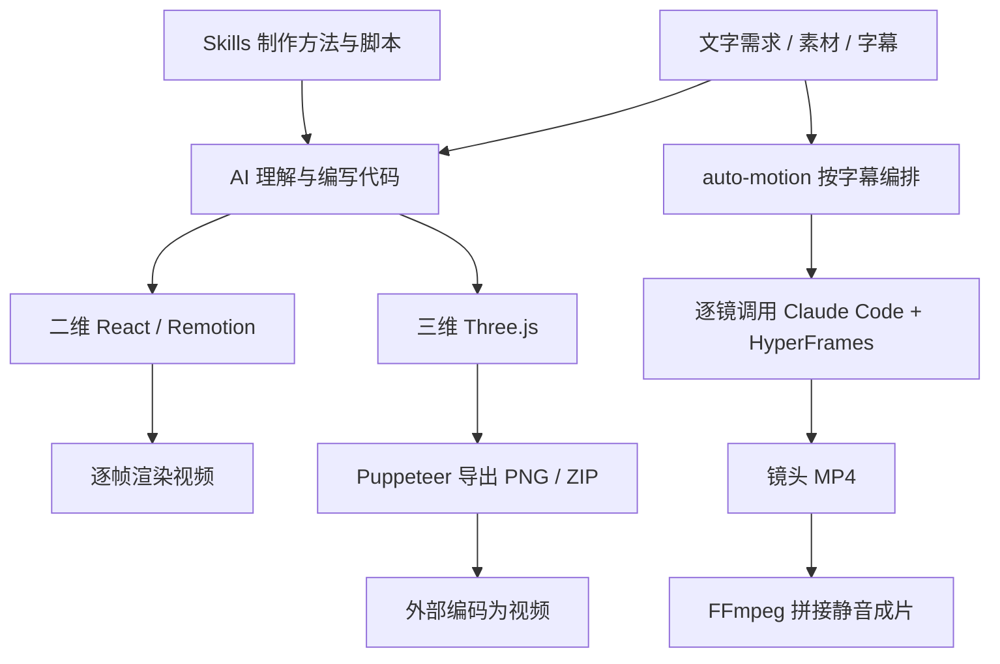

# 能力与实现研究

研究日期：2026-09-16。所有源码结论针对 [版本与文件清单](inventory.json)，不随 main 分支自动更新。下面链接指向本地固定版本快照。

## 1. 整体模型

Vibe Motion 是一个组织下的工具集合。把它理解为三层最直观：

| 层 | 负责什么 | 对应项目 |
| --- | --- | --- |
| 创作与编排 | 理解需求、找素材、设计分镜、写动画代码 | AI 智能体、Skills、auto-motion 的任务说明 |
| 动画工程 | 定义对象、样式、参数、时间轴和音轨 | create-vibe-motion、create-vibe-motion-3d、各独立效果项目 |
| 渲染与输出 | 按帧绘制、抓取画面、编码和拼接 | Remotion、Three.js/Puppeteer、HyperFrames、FFmpeg |

这些是几条可选制作路线，并非安装一个库就同时启动的统一引擎。尤其 auto-motion 当前使用 HyperFrames，不直接调用两个 create 脚手架。

## 2. 二维脚手架：动画代码与运行支撑分离

核心入口是 [motion/plugin.js](../upstream/create-vibe-motion/packages/template/motion/plugin.js)，把场景组件、默认参数、时长、画面尺寸和每帧属性组织为一个对象。

- [config.js](../upstream/create-vibe-motion/packages/template/motion/config.js)：默认文字、1080×1440、3 秒、速度和倾斜角。
- [timeline.js](../upstream/create-vibe-motion/packages/template/motion/timeline.js)：把输入标准化，并由 `frame` 计算进度、旋转角和偏移量。
- [Scene.jsx](../upstream/create-vibe-motion/packages/template/motion/Scene.jsx)：将计算出的属性画成 React 场景。
- [pluginRuntime.js](../upstream/create-vibe-motion/packages/template/remotion/pluginRuntime.js)：供预览和渲染层调用统一接口。
- [AudioTracks.jsx](../upstream/create-vibe-motion/packages/template/remotion/AudioTracks.jsx)：加载音轨清单，通过 Sequence 与 Audio 放置音频；Studio 下支持文件变化同步与拖入入口。

### 最值得复用的原则：每一帧独立可计算

例如第 45 帧的方块位置应由“第 45 帧 + 参数”直接算出。即使先渲染第 80 帧，再渲染第 3 帧，第 45 帧仍应相同。这方便拖动播放头、并行渲染和局部重渲。

本研究实测了乱序请求不改变同帧参数。它证明的是默认时间轴函数的行为；用户新写的场景仍需遵守这个约定。

### 模板限制与引擎能力应分开

此版本的参数函数把宽度限制在 480–1280、高度限制在 480–1440、时长限制在 1–30 秒。实测传入 1920×1080 得到 1280×1080。要制作全高清横屏或更长视频，需要修改这层模板约束；这不是 Remotion 本身的上限。

`loop=true` 对帧号取余，只保证循环取帧。默认动画包含非整数周期的正弦表达式，不能由此推断首尾一定视觉无缝。

音轨清单支持起始帧、持续帧数、音量和按 composition 分组；这是播放和管理成品音频的能力，不等于语音生成或语音识别。本次只测试了清单处理，未验证实际混音。

## 3. 三维脚手架：场景、时间轴与导出契约

[index.js](../upstream/create-vibe-motion-3d/packages/template/index.js) 提供 Three.js 场景：标题、环形几何、方块、灯光、网格和有种子的星空。默认 90 帧、30fps、2048×1152。

它向浏览器暴露 `window.__SCENE_3D_EXPORT__`，包含就绪状态、当前帧、总帧数、尺寸和 `setFrame(frame)`。相机和物体状态由帧进度计算。

[export-api.mjs](../upstream/create-vibe-motion-3d/packages/template/scripts/export-api.mjs) 提供：

- `POST /export/frame`：返回指定帧的 PNG。
- `POST /export/sequence`：返回连续帧的 ZIP，起止帧均包含。
- 使用本地 Chrome/Chromium/Edge，无需另装完整 Puppeteer 浏览器包。
- 导出队列串行处理；每次任务启动浏览器，等待场景就绪，再设置帧号和截图。

**原生接口没有 MP4 编码。** 本研究用其原始 PNG 序列，再调用 FFmpeg 合成了示例视频。默认导出画面有背景，本次也没有验证透明输出。

从实现推断：ZIP 导出会把所有 PNG 收集到内存后合并，长片或高分辨率导出时应评估内存占用；本次只测了 90 帧，没有做性能压测。

## 4. auto-motion：由提示词协调的制作流程

主要依据：[PROMPT.md](../upstream/auto-motion/PROMPT.md)、[单镜头脚本](../upstream/auto-motion/exampleFolder/run-claude-ai.sh)、[验证脚本](../upstream/auto-motion/auto-test/validate.sh)。

1. 输入已经带时间戳的 SRT。工作流不在这里负责把原始音频转为字幕。
2. 让调度智能体按语义合并字幕，分配镜头目录、时长和文案。
3. 保留字幕间的空白；镜头总时长覆盖第一条字幕开始到最后一条结束的跨度。
4. 顺序调用 Claude Code，使用 HyperFrames 编写与渲染每镜画面。
5. 从流式日志中过滤四个阶段消息，并保留原始日志与错误日志。
6. 核对规格，使用 FFmpeg 拼接为 `final.mp4`。

**程序负责执行、日志和媒体处理；分镜语义、视觉设计、提示词修改和失败处置仍依赖智能体判断。** `PROMPT.md` 是操作契约，并没有实现一个无需模型即可执行的分镜器。

交付要求为 1080×1440、30fps、静音、无音轨。单镜提示词明确不要求逐字显示文案，因此也不能将其视为“默认烧录完整字幕”的保证。需要声音或逐字字幕时，应增加独立的制作步骤。

### 自动验收的实际覆盖比简介更窄

本版本 `auto-test/validate.sh` 固定检查 `scene-001` 与 `final.mp4`，时长范围为 0.85–1.25 秒，并查验四条阶段日志、分辨率、帧率和无音轨。因此它是约 1 秒样例的冒烟检查，不能直接作为任意长片、多镜头覆盖、事实准确、视觉质量或跨镜一致性的验收器。

本机已发现 Node、FFmpeg、Codex 与 Claude 可执行文件；当前 PATH 中未发现 jq，Bash 仅发现 WindowsApps 入口，未验证其可用性。未检查账号状态，也未运行模型生成流程。Windows 上复现完整链路仍需核实 Bash/jq 与各 CLI 的调用环境。

## 5. Skills：三种不同的复用方式

固定版本有 15 个顶层 Skill，详见 [能力目录](skills.md)。研究快照中的 SKILL.md 仅用于分析，没有安装或执行这些技能。

| 类型 | 例子 | 含义 |
| --- | --- | --- |
| 参数化生成 | 聚光灯文字、线帘 | 调脚本替换模板参数，输出 HTML |
| 调用效果项目 | 尺子、游鱼、微信、地球、鱼眼 | 拉取独立项目并执行其渲染命令 |
| 创作和质量方法 | 品牌发布片、pixel2motion、动画原则 | 让智能体按步骤组织素材、叙事、几何与检查 |

一个值得留意的依赖：`claude-typer` 使用远端站点中的 Remotion composition。即使固定 Skill 的 commit，远端效果仍可能变化或不可访问。部分其他技能会跟踪外部仓库默认分支；要追求可复现结果，应再固定这些依赖的版本。

品牌宣传 Skill 要求使用准确的官方 Logo；pixel2motion 则面向栅格转矢量与动画制作。实际任务应明确素材要求，不能默认将两套工作流任意串接。

## 6. 对现有研究项目的意义

| 项目 | 主要关注点 | 可结合的方向（研究判断） |
| --- | --- | --- |
| 001 语音驱动纸艺剧场 | 音频时间轴与纸艺场景表达 | 用 Vibe Motion 的可复用效果扩展画面种类 |
| 003 Video TalkCraft | 成品配音、逐字对齐与口播制作规范 | 把 Vibe Motion 动效作为候选镜头素材或组件 |
| 004 Vibe Motion | 代码动画基础工程、效果技能与字幕编排 | 提供二维/三维生产起点与局部动画能力 |

以上是适配方向，尚未实现跨项目集成。若用于培训和产品讲解，优先保留现有的配音与时间轴规范，再试接一个动效；不要直接假定不同库的参数、时间单位、画幅或输出格式完全兼容。
