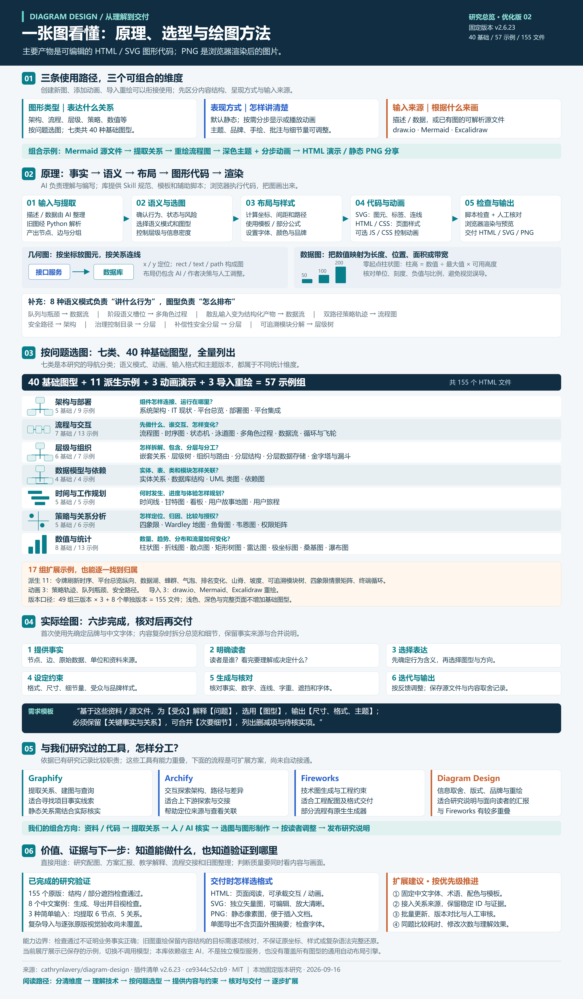
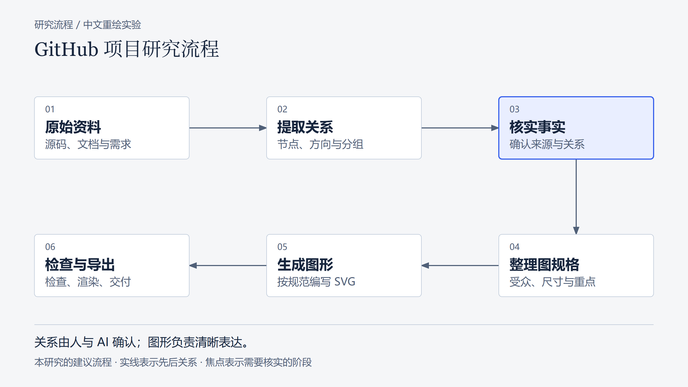

# 005 · Diagram Design：图形设计规范与效果展厅

让 AI 根据文字、数据或旧图源文件，按设计规范生成可编辑的 HTML/SVG，并导出 PNG。覆盖架构、流程、层级、数据模型、时间规划、策略关系和数值统计七类 40 种基础图型；支持品牌样式、分步动画及 draw.io / Mermaid / Excalidraw 重绘。适合研究说明、方案汇报、教学和流程交接。

[在线研究展厅](https://yydshly.github.io/0914_codex_project/005-diagram-design/) · [所有绘图与下载](https://yydshly.github.io/0914_codex_project/005-diagram-design/drawings.html) · [全部绘图记录](notes/drawings.md) · [详细理解](notes/analysis.md) · [绘图技术原理](notes/drawing-technology.md) · [按类型分类](notes/taxonomy.md) · [完整图型清单](notes/gallery.md) · [实验记录](notes/experiments.md) · [上游](https://github.com/cathrynlavery/diagram-design)

## 一图理解：原理、选型与绘图方法



[第二版高清 PNG](assets/diagram-design-overview-v2.png) · [第二版可编辑 SVG](assets/diagram-design-overview-v2.svg) · [第一版 PNG](assets/diagram-design-overview.png) · [第一版 SVG](assets/diagram-design-overview.svg)

图型、表现方式与输入来源是三个可组合维度。比如：Mermaid 源文件 → 提取流程关系 → 重绘为深色流程图 → 添加分步动画 → HTML 演示或静态 PNG 分享。主要产物是矢量图代码，PNG 是渲染后的图片。

## 所有绘制的图有哪些？

- **两版理解总览**：第一版梳理原理、分类、步骤和用途；第二版补全选图问题、8 种语义模式、17 组扩展示例、工具分工与验证边界。
- **八版中文案例**：研究流程蓝色、橙色、深色、完整解释页面、管理者三阶段概览、16:9 幻灯片、手绘线条、边注强调；每版均提供 HTML / SVG / PNG。
- **辅助图片**：八例联系表；蓝色案例的研究流程封面副本。封面副本和联系表不另计原创图型。
- **上游原版**：57 组、155 个 HTML，原样归档，保留作者和许可，内容不属于本次原创。

完整名称、表达内容、格式、尺寸与文件入口见[全部绘图清单](notes/drawings.md)。

## 中文研究案例



这张图由本次 AI 按 Diagram Design 规范编写，是我们的建议研究流程；不表示库已经实现自动分析代码到交付的整条流水线。

## 本次成果

| 内容 | 实际范围 |
|---|---|
| 原版全量效果 | 57组、155个HTML：49组三版本，8个单独版本 |
| 中文图型导航 | 架构与部署、流程与交互、层级与组织、数据模型与依赖、时间与工作规划、策略与关系分析、数值与统计 |
| 理解总览 | 两版 SVG / PNG：原理、分类、绘图方法、工具分工和验证边界 |
| 中文对照案例 | 蓝色、橙色、深色、完整页面、三阶段概览、16:9幻灯片、手绘线条、边注，共8版 |
| 导入实验 | 同一份6节点5关系，用Mermaid、draw.io、Excalidraw源文件跑上游提取器 |
| 导出 | 8组HTML/SVG/PNG；常规PNG 2560×1440，幻灯片3200×1800 |
| 清单与检查 | 155个原版与8个案例通过self_check及标签遮挡检查；模块元数据导出与检查 |
| 工具对照 | Fireworks、Archify、Graphify的定位、原理和我们该如何使用 |

**57组是示例组数，不是57个独立图型或绘图引擎。** 按固定Skill图型表和原版样例核对：40个基础图型、11个派生示例、3个动画、3个导入重绘。分为七类，可按类型和示例层级筛选。原版示例保留英文与原始样式；中文案例是本次AI创作。

展厅部署为 GitHub Pages 静态研究页面，也可本地运行：切换的是已保存结果，没有在线模型、实时绘图和自动仓库扫描服务。

## 能力、输入与输出

输入可以是用户描述、整理好的系统关系、数据或支持的图形源文件。事实由用户或外部AI确认；Skill帮助选择图型、读取规范、编写布局。脚本辅助提取结构与检查；浏览器完成渲染。

输出以单文件HTML和内联SVG为基础，可导出PNG。完整版包含页面摘要等外围内容；PNG/SVG单图导出不包含这些内容。原版可引用Google Fonts，单文件并不保证字体完全离线一致。

## 与过去研究的关系

- **Fireworks**：最直接的同类，JSON绘图、连线路由、工程规则与图片交付是我们已验证的重点。
- **Archify**：更适合点击探索架构、上下游、路径、源码关联与模型差异。
- **Graphify**：更上游的关系提取和图查询。
- **Diagram Design**：适合把确认后的内容整理成面向读者、风格一致的图和解释页面。

建议组合仍未接通，没有跨工具效率排名。当前优先验证中文规范、复杂信息的取舍与旧图重绘对研究交付的价值。

## 版本与许可

| 项目 | 内容 |
|---|---|
| 固定提交 | `ce9344c52cb9be811de187bf2a6d58c712c9c9fe` |
| 插件版本 | 2.6.23（Skill metadata另写2.6） |
| 日期 | 2026-09-16 |
| 上游许可 | [MIT，Cathryn Lavery](upstream/LICENSE) |
| 第三方素材 | [图标及商标来源](upstream/THIRD_PARTY_LICENSES.md) |
| 本次方式 | 本地复制所需Skill与示例；未全局安装插件 |
| 线上地址 | https://yydshly.github.io/0914_codex_project/005-diagram-design/ |

## 复现

从研究总仓库根目录运行。构建展厅只需Python标准库，已保存的图形与PNG可以直接复用。

```powershell
python projects/005-diagram-design/src/build.py
python projects/005-diagram-design/src/verify_site.py
python -m http.server 8785 --bind 127.0.0.1 --directory projects/005-diagram-design/web/dist
```

打开 <http://127.0.0.1:8785/>；也可以直接打开本地HTML。

重新制作案例与导入、检查实验：

```powershell
python projects/005-diagram-design/src/make_cases.py
python projects/005-diagram-design/src/experiments.py
python projects/005-diagram-design/src/export_cases.py
python projects/005-diagram-design/src/build.py
```

`export_cases.py`需要已安装Playwright、Chromium和Pillow。本次复用了现有环境，没有安装新系统依赖。它只渲染独立图形资产，不是展厅截图。`verify_site.py`额外使用Pillow和Node进行资产与语法检查。

## 验证边界

- 三个简单源文件核对了节点ID、名称和关系；不代表复杂或不受支持的语法全部可靠。
- 全量原版运行了结构与标签遮挡检查；没有逐张目视验收155个原版文件。
- 8张中文PNG导出并核对像素尺寸，已查看联系表；不保证其他设备字体相同。
- 完成静态资源、脚本语法和输出完整性检查；另用 Chromium 验证七个导航面板、分类筛选、版本切换、八个案例、绘图清单与手机端宽度。不是全套跨浏览器测试。
- 没有验证网站自动品牌提取、全局Profile管理、安装兼容性或真实业务事实。

## 目录

- `upstream/`：固定版本所需原版Skill、示例、检查工具与许可。
- `web/`：展厅源码；`web/dist/`为可重新生成的静态输出。
- `src/`：本次构建、案例、实验、导出和检查程序。
- `inputs/`：三类源文件与内容说明。
- `cases/`：本次中文HTML、SVG、PNG。
- `evidence/`：提取器结果、检查、清单与PNG记录。
- `notes/`：原理、区别、场景、扩展、样式与图型清单。
- `assets/`：两版理解总览的 SVG/PNG、研究流程封面与案例联系表。

[返回总索引](../../README.md)
