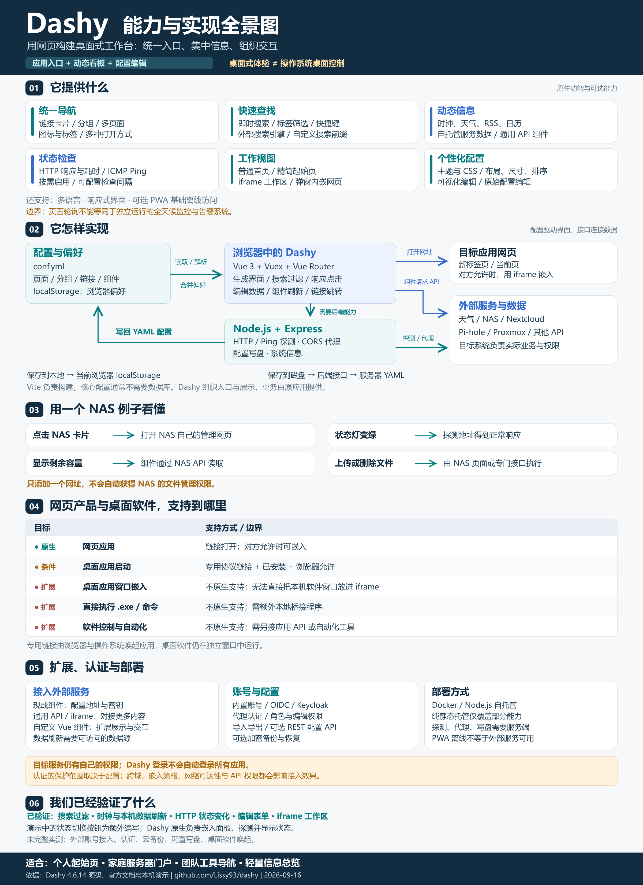
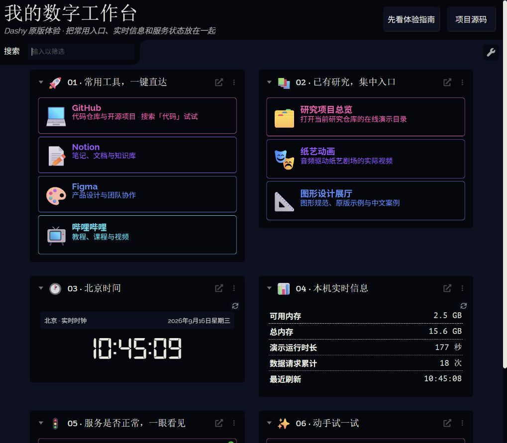

# 006 · Dashy：网页式应用工作台与信息看板

**Dashy 用网页构建可自定义的应用工作台：集中网站与后台入口，通过组件展示 API 数据和服务状态。** 它的意义是减少记网址、找入口、逐个进入后台查看信息的重复操作，适合个人首页、家庭服务器门户和团队工具导航。具体业务仍由原应用执行；桌面软件仅在支持专用链接等条件下可以被唤起，原生桌面控制需要另外接入工具。

本子项目保存原版中文交互演示、架构全景图、真实界面截图和完整研究结论，另提供可公开阅读的静态研究网页。

[在线研究网页](https://yydshly.github.io/0914_codex_project/006-dashy/) · [打开本机工作台](http://127.0.0.1:8060/) · [三分钟体验指南](http://127.0.0.1:8060/guide.html) · [示例配置](user-data/conf.yml) · [来源与版本](notes/sources.md)

本机地址需要先启动下面的服务。静态研究页通过现有 GitHub Pages 流程发布；完整原版交互演示的后端只在本机运行。公开页面展示历史实拍，不连接访问者电脑。

## 一张图理解能力、原理与边界

六个部分覆盖能力地图、配置驱动架构、NAS 示例、网页与桌面应用边界、扩展与部署，以及实际验证范围。

[高清 PNG（2400 × 3300）](assets/dashy-capability-overview.png) · [可缩放 SVG](assets/dashy-capability-overview.svg) · [完整文字说明与出处](notes/capability-overview.md)



## 原版运行效果



## 先体验这五件事

1. **找应用**：搜索框输入“代码”，观察卡片按标签过滤；清空恢复。
2. **看动态信息**：观察时钟跳动，以及“本机实时信息”每 10 秒刷新的内存、运行时长和刷新时间。
3. **看服务状态**：点击“可切换的服务示例”，在弹窗里切换正常/维护中，返回首页等约 10 秒，观察状态灯跟着 HTTP 200/503 变化。
4. **改成自己的首页**：顶部菜单切换主题；在“选项”中进入编辑模式，可改卡片标题、网址和分组，或添加自己的入口。
5. **体验工作区**：点击“体验嵌入工作区”，在 Dashy 中打开示例控制面板。

“保存到本地”只影响当前浏览器；“保存到磁盘”修改本项目 `user-data/conf.yml`，原版会保存旧配置备份。关闭浏览器后再次打开，同一浏览器的本地偏好可能继续覆盖文件配置。

## 快速运行

Windows PowerShell，在当前子项目目录运行：

```powershell
.\start.ps1
```

第一次运行会按固定版本下载源码和独立运行环境、安装依赖并构建。需要联网和可用的 npm。后续直接启动已构建应用，地址为 `http://127.0.0.1:8060/`。服务后台运行，仅监听本机。

停止：

```powershell
.\stop.ps1
```

手动重新构建：

```powershell
.\src\bootstrap.ps1
```

日志位于 `.cache/server.log` 和 `.cache/server-error.log`。没有修改全局 Node 环境或其他子项目。

## 页面里的内容来自哪里

| 页面内容 | 原版能力 | 演示数据来源 |
| --- | --- | --- |
| 常用工具、已有研究 | 分组导航、标签、搜索、打开方式 | 中文配置中的公开网址 |
| 北京时间 | 原版 Clock 组件 | 当前时间 |
| 本机实时信息 | 原版 Custom API 组件、定时刷新 | 本地演示接口读取本机内存和进程信息 |
| 两个服务状态灯 | 原版 HTTP 状态检查 | 本地示例实际返回 200 / 503 |
| 指南弹窗、嵌入工作区 | 原版 modal / workspace 打开方式 | 本地 HTML 指南与控制面板 |
| 换主题、编辑和保存 | 原版主题与配置编辑器 | 浏览器本地存储或本项目 YAML 文件 |

示例状态服务不代表已有真实业务服务。天气、NAS、Pi-hole、Nextcloud 等组件需要另行接入对应服务地址或密钥。

## 配置怎样变成页面

`user-data/conf.yml` → 原版前端读取 YAML → Vuex 管理页面状态 → Vue 渲染分组、卡片和组件。

动态组件向 API 请求数据；服务状态由原版后端主动探测；编辑器更新同一份配置对象；保存到磁盘经原版 `/config-manager/save` 接口写回 YAML。

## 项目文件

- `user-data/conf.yml`：可以直接修改的中文工作台配置。
- `user-data/guide.html`：面向使用者的体验指南。
- `user-data/control.html`：可切换状态的示例服务面板。
- `src/server.cjs`：加载原版 Dashy，并添加本地演示数据接口。
- `src/bootstrap.ps1`：固定版本下载、依赖安装和构建。
- `start.ps1` / `stop.ps1`：后台启动和精确停止本项目服务。
- `assets/`：实际浏览器截图。
- `web/`：公开研究展示网页；使用架构图和原版实拍引导阅读。
- `src/build_site.py`：只打包明确列出的公开网页与资产，不发布本机运行目录。
- `.cache/`：可重建的上游源码、依赖和日志，不进入版本管理。

## 实际验证

- 原版生产构建成功，配置通过上游 Schema 校验。
- 搜索“代码”只保留 GitHub 入口，清空后恢复全部卡片。
- 实时时钟和本机数据正确显示，刷新时间与请求计数持续更新。
- 弹窗内切换示例状态 503 → 200，原版状态灯变绿；已恢复默认维护状态。
- 进入编辑模式并打开卡片表单，标题、网址、图标和标签均可编辑；未改动示例卡片。
- 工作区正确嵌入控制面板；浏览器检查未发现控制台错误。
- 未接入外部服务账号；认证、云备份和磁盘保存未做完整交互测试。

[查看卡片编辑截图](assets/edit-item.png) · [查看嵌入工作区截图](assets/workspace.png)

## 上游与许可

[Dashy](https://github.com/Lissy93/dashy) · 版本 4.6.14 · MIT · commit `6c56436d5f044d3c53371891c9d9a8c8df8c4606`。上游源码未做修改，许可证保留于 [UPSTREAM-LICENSE.txt](notes/UPSTREAM-LICENSE.txt)。

[返回总索引](../../README.md)
