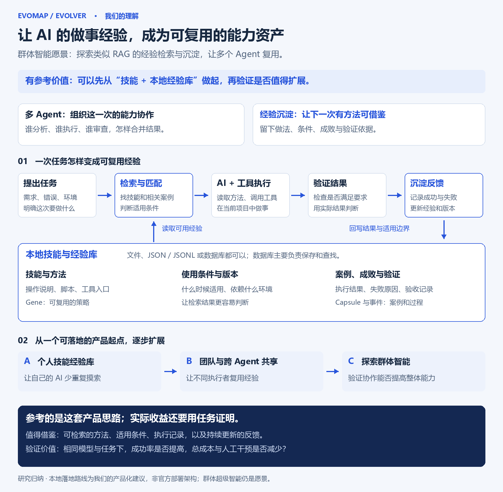
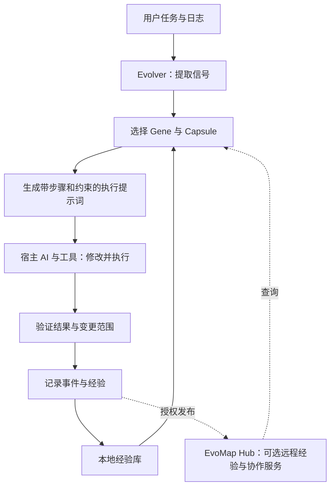

# 007 · EvoMap / Evolver：AI 经验复用与自进化研究

**我们的理解：EvoMap 以群体智能为愿景，探索类似 RAG 的经验检索与沉淀，让多个 Agent 复用做事方法，并用执行验证与反馈继续积累经验。这是具有参考价值的产品方向，尚不能据此认定实现了群体超级智能。**

“类似 RAG”指先检索外部经验，再交给模型使用；不是认定底层使用向量数据库，也不是把整个系统等同于 RAG。可复用的内容包括策略、适用条件、执行案例、失败记录与验证依据。多 Agent 可以跨时间、跨任务复用，不必同时协作。规则约束格式与流程，模型与工具执行任务，反馈为下一次选择提供依据。

可落地的产品起点是“技能＋本地经验库＋检索＋执行验证＋反馈回写”，再验证是否值得扩展到团队共享。这是我们的产品化建议。Evolver 是执行侧的客户端引擎；实际修改代码依赖具备模型与工具权限的执行环境。

第一阶段已完成：固定版本归档、能力分析、架构梳理、77 项上游测试和原版模块探针。项目保持“研究中”，完整修复闭环、云端协作和效果收益仍待实测。

## 阅读入口

- [网页构建与启动说明](web/README.md)：从愿景、类似 RAG 的经验机制、多 Agent 复用和证据边界理解 EvoMap，含五步交互案例。
- [能力与实际用途](notes/capabilities.md)：谁使用、输入什么、产出什么、还缺什么。
- [架构与原理](notes/architecture.md)：从日志到经验选择、执行提示、验证和资产记录。
- [实验报告](notes/experiments.md)：测试结果、合成案例、反例与证据边界。
- [来源与版本](notes/sources.md)：固定 commit、原始链接、环境与许可。

## 一张图：值得参考的产品方向

把技能、可检索经验和验证反馈组织成持续积累的系统，可以先从个人的“技能＋本地经验库”做起，再考虑团队共享。这是我们的产品化建议，收益需要用真实任务验证；不代表群体超级智能已经实现。



[高清 PNG](assets/product-understanding.png) · [可编辑 SVG](assets/product-understanding.svg)

## 已确认的五件事

1. **基础路径产出执行提示词。** 原版提示词模块产生 16,106 字符，包含任务上下文和选中 Gene。生成指令不等于执行指令。
2. **经验选择可离线工作。** 原版选择器能从随包 17 条种子 Gene 中选择修复策略，也能匹配合成 Capsule；实验没有访问 Hub。
3. **选择器存在备用策略。** 对无关输入，完整种子库返回 `distilled_fallback`；只包含精确修复策略的对照库返回空。需要区分匹配与兜底。
4. **哈希只验证内容一致性。** 内容改动导致旧哈希失效，但错误陈述算出新哈希后仍通过校验。业务正确性需要独立测试。
5. **核心源码可读性有限。** 202 个已跟踪 src JavaScript 文件中，57 个包含混淆标识符，覆盖主流程、选择、提示词等。研究依据文档、可读测试与动态结果，未完成核心实现的逐行审计。

## 一张图看懂分工



图是概念上的完整闭环。本次动态实验覆盖选择、内容哈希和提示词生成；未执行模型修复、发布或云端协作。

## 具体用途

我们当前的理解是：EvoMap 是探索群体智能的一条工程路线，尝试通过经验共享和任务协作改善整体能力。局部组件可运行、整体协作更有效、实现群体超级智能是三个不同层次，后两者不能由前者直接推导。网页导读围绕这个区别展开。

例如，AI 遇到“上传文件超时”，先找别人记录过的方法，再结合文件大小、接口限制和软件版本判断适用性。真正修改与测试的是执行 Agent。成功经验可以整理成“适用条件＋步骤＋案例＋验证记录”，供以后参考。

此例仅解释机制，没有实测真实上传修复。值得继续验证的是重复报错、项目维护和常见接口接入能否减少试错；一次性任务或完全不同的环境未必有收益。

## 复现实验

要求 Python 3.10+、Git、Node.js 22.12+、npm。本次使用 Windows 与 Node v22.15.0。以固定版本包配置的 Node 要求为准，README 中 Node 18 的说明已与之不一致。

在本子项目目录运行：

```powershell
python src/research.py --bootstrap
```

首次下载固定 commit 并按锁文件安装依赖，禁用安装脚本。后续重新验证：

```powershell
python src/research.py
```

实验直接调用模块，不启动 Evolver 主程序或守护循环。测试进程使用独立配置目录、不继承模型密钥，并限制文件访问和网络入口。输出在 `notes/`；生成提示词在 `.cache/generated-prompt.txt`。这些实验约束不能替代完整安全审计。

## 研究版本

| 项目 | 内容 |
| --- | --- |
| 上游 | [EvoMap/evolver](https://github.com/EvoMap/evolver) |
| 版本 | 1.94.0 |
| Commit | `31b0691acd97ba18878019312e646f1f2d970d43` |
| 锁文件解析的 GEP SDK | 1.12.1 |
| 上游声明的许可 | GPL-3.0-or-later；保留 [LICENSE](notes/UPSTREAM-LICENSE.txt) |
| 研究日期 | 2026-09-16 |
| 验证 | 19 项哈希＋47 项选择器＋11 项提示词测试通过；研究探针通过 |
| 云端验证 | 未进行 |
| 在线演示 | 暂无 |

## 后续验证

- [ ] 在独立样例仓库和选定执行宿主中跑通“失败→修复→验证→记忆→复用”。
- [ ] 做无经验、普通操作说明、Gene/Capsule 三组对照，保持模型、预算和验收任务一致。
- [ ] 记录成功率、Token、耗时、错误采纳和回滚，不能仅凭提示词更短宣称收益。
- [ ] 用专门测试账户验证 Hub 检索、发布、独立验证及多 Agent 协作。
- [ ] 单独研究 solo、代理和宿主适配路径，避免把基础提示词模式当成全部执行模式。

## 文件结构

- `notes/`：研究正文、原始输出、版本证据与许可。
- `src/research.py`：固定版本获取、隔离运行、测试与证据生成。
- `src/probe.cjs`：调用原版模块的合成案例，不执行生成的提示词。
- `src/offline-guard.cjs`：实验用网络入口拦截。
- `.cache/upstream/`：本机上游 checkout 与依赖，不纳入总仓库。
- `web/`：中文网页导读及五步经验流动示例，由统一 GitHub Pages 工作流构建发布。
- `src/build_site.py`：只打包网页及公开实验摘要，并检查资源与章节链接。
- `assets/`：产品方向理解图，提供 PNG 与可编辑 SVG。

[返回总索引](../../README.md)
