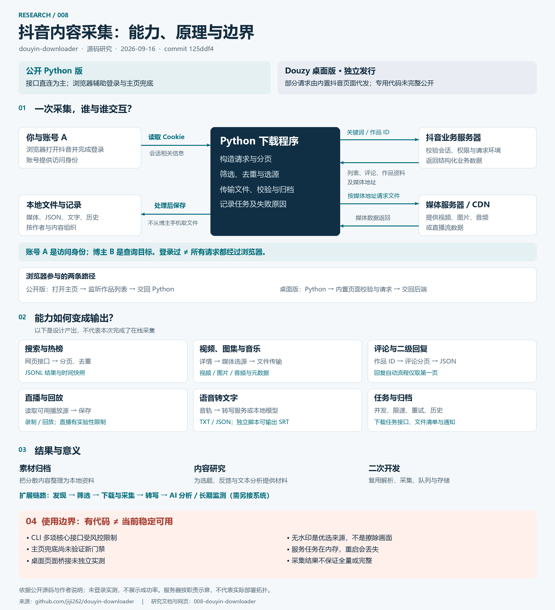

# 008 · Douyin Downloader：抖音采集与下载原理研究

**核心价值：把抖音信息的获取做成可重复执行的采集、下载与归档流程，为素材库、内容研究和后续 AI 分析提供“数据获取与整理层”。** 它已有搜索与热榜、评论采集、视频／图集／音乐下载、直播与回放、语音转文字、批量任务及本地记录等实现；当前实际可用性仍受平台接口、访问权限与风控影响。

技术上以抖音网页内部接口为数据来源。登录提供会话身份，Python 组织请求和下载，浏览器负责登录及特定请求环境。公开 Python 版以接口直连为主；Douzy 桌面版另有页面桥接，不能把两者当成同一份完整产品。

本子项目沉淀讨论形成的理解，提供研究文档、交互网页和单张全景图。网页是原理导读，不是抖音客户端：不登录、不采集 Cookie、不发送抖音请求。“效果”指代码设计的输出形态，不表示本次在线下载成功。

## 阅读入口

- [理解与交互原理](notes/understanding.md)：账号、浏览器、程序和抖音服务器如何交互。
- [能力、输出与价值](notes/capabilities.md)：搜索、评论、下载、直播、转写、任务管理及边界。
- [源码证据与版本](notes/sources.md)：固定版本链接、证据层级、许可和文档差异。
- [验证记录](notes/verification.md)：本子项目的构建与网页检查，不冒充上游在线测试。
- [网页说明](web/README.md)：本地构建与阅读方法。

## 在我们自己的系统中处于哪一层

**抖音内容 → 获取、筛选与归档〔本库〕→ 分析、总结与业务洞察〔另接系统〕。**

| 问题 | 本库提供的工程基础 | 对我们的意义 |
| --- | --- | --- |
| 如何取得数据 | 会话信息、网页接口、请求签名与浏览器辅助 | 理解内容从何而来、以什么身份访问 |
| 如何重复批量执行 | 分页、去重、并发、限速、重试与任务状态 | 减少手工操作，组织可重复的获取流程 |
| 如何保存与使用 | 媒体文件、评论与搜索数据、转写文字、元数据和历史 | 为本地素材库与后续分析准备输入 |

它的现成能力止于相应的数据处理与输出；完整的 AI 洞察、知识库和长期监测需要另外建设。工程流程可以复用，持续可用性不能仅凭有代码保证。

## 一张图：能力、原理、效果与边界



[高清图片](assets/douyin-overview.png) · [可编辑 SVG](assets/douyin-overview.svg) · [图片制作记录](notes/image-production.md)

## 已确认的核心认识

1. **登录、API、爬虫不是三选一。** 登录提供身份；接口交换数据；自动请求、翻页与保存构成采集行为。
2. **账号不是请求程序。** 账号 A 是访问身份，博主 B 是查询目标，数据来自抖音服务器，而不是 B 的手机。
3. **登录过不等于所有请求都走浏览器。** CLI 读取 Cookie 后通常由 Python 直接请求；主页受限时另有 Playwright 兜底。
4. **桌面版的浏览器作用更深入。** 受限请求可交给内置抖音页面发出，但关键桥接实现不在这份公开仓库中。
5. **搜索与评论获取结构化数据。** 搜索由抖音匹配排序；本库负责分页与保存。二级回复当前自动流程仅请求第一页。
6. **下载分为取资料和取文件。** 先取得作品信息与媒体地址，再传输视频、图片或音频；前一阶段被拦截会阻断流程。
7. **代码存在不等于当前可用。** 作者披露多项 CLI 核心接口受风控影响。本次没有登录抖音或验证桌面版成功率。

## 构建与阅读

在总仓库根目录运行（Python 3.10+，构建无需第三方依赖）：

```powershell
python projects/008-douyin-downloader/src/build_site.py
python -m http.server 8088 --bind 127.0.0.1 --directory projects/008-douyin-downloader/web/dist
```

打开 <http://127.0.0.1:8088/>，也可直接打开 `web/dist/index.html`。主要内容和交互离线可用，来源链接需联网。

## 研究版本

| 字段 | 记录 |
| --- | --- |
| 上游 | [jiji262/douyin-downloader](https://github.com/jiji262/douyin-downloader) |
| 固定 commit | `125ddf4d7196b7a18fe3a0258cc746503c9d1c57` |
| 包版本 | `2.0.0`（不能代替 commit 作为复现标识） |
| 研究日期 | 2026-09-16 |
| 上游许可 | MIT，见 [许可副本](notes/UPSTREAM-LICENSE.txt) |
| 证据 | 源码静态核对＋作者现状披露 |
| 在线采集 | 未执行；没有 Cookie 或真实账号数据进入本项目 |
| 发布 | 已准备静态网页；线上状态以实际部署验证为准 |

目录：`notes/` 保存研究与验证，`assets/` 保存图片，`web/` 为网页源文件，`src/` 为打包检查脚本。后续实际可用性验证需分别测试搜索、详情、评论、主页及媒体传输，不把空列表直接解释成“没有内容”。

[返回总索引](../../README.md)
