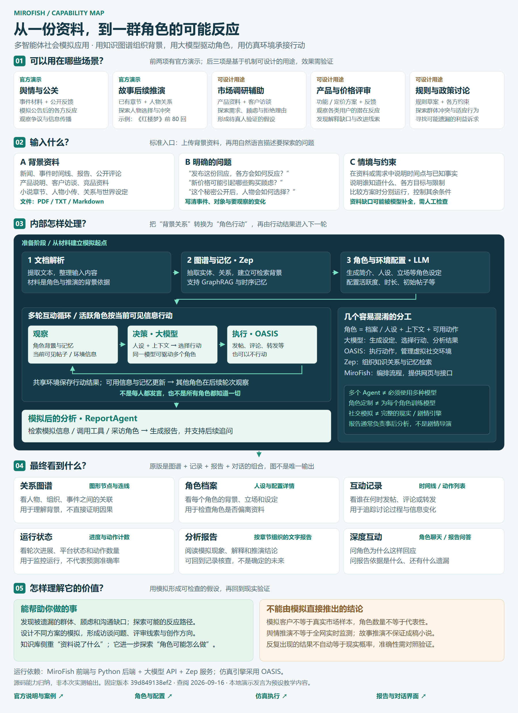
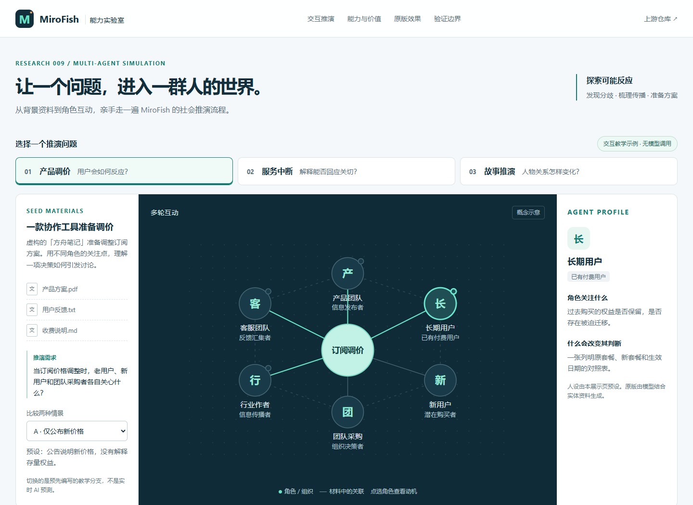

# 009 · MiroFish：多智能体社会推演能力展示

**MiroFish 是多智能体社会模拟应用。**输入背景资料与假设问题，系统通过知识图谱组织背景、生成角色与环境配置，再由大模型驱动角色在 OASIS 虚拟社交环境中多轮互动，最后提供关系图、角色档案、互动记录、运行状态、分析报告和后续对话。

它可用于舆情与公关预演、人物与故事后续探索，也可设计市场调研辅助、产品定价和规则评审实验。价值在于发现可能遗漏的顾虑、传播分歧与待验证假设；模拟角色不等于真实调研样本，生成报告不等于预测准确。它使用知识库与检索，但整体不是单独的知识库问答工具或技能提示词。

本子项目是独立中文交互展厅。首先用 **Unity 2023—2024 年收费变更真实事件**解释决策价值，再用产品调价、服务中断、原创故事三个教学案例展示五步机制。**Unity 历史事实有公开来源，候选实验为研究者设计；三个教学案例为人工编写。均未调用上游模型、Zep 或 OASIS。**

## 先看一个真实场景

先看最新的 [能力全景图 PNG](assets/mirofish-capabilities.png) / [可缩放 SVG](assets/mirofish-capabilities.svg)：一张图汇总五类场景、三类输入、内部处理循环、六种呈现方式与价值边界，区分官方案例与可设计用途。已放在[网页总览](http://127.0.0.1:8079/#overview)。

先看 [构建与使用流程图](assets/mirofish-workflow.png)：包含使用场景、运行环境、输入、角色定制、多 Agent 与模型的区别、交互循环及结果输出。



[可缩放 SVG](assets/mirofish-workflow.svg) · [网页图解](http://127.0.0.1:8079/#overview)。图示为固定版本源码的机制归纳，不是运行结果。关键：同一个大模型可驱动多个 Agent；角色定制是生成档案、提示词和行为配置，不是训练新模型。

打开本地页面的 [Unity 真实案例](http://127.0.0.1:8079/#real-case)。它围绕“收费方案修订后，开发者为什么仍可能担心未来规则”展开，区分真实公开反馈、官方修订与后续取消公告，并提供三种候选方案的检验设计。

核心价值判断：如果模拟让团队发现一项此前遗漏、并被真实客户验证的问题，推动发布前修正，它才创造了决策价值。若只是重复公开材料已明确说出的“信任”问题，单模型或直接阅读可能已足够。

- [截至 2023-09-22 的资料摘要](notes/unity-seed.md)：可作为原版运行的起始材料，仍需补充客户分层与反馈。
- [真实运行实验设计](notes/unity-experiment.md)：输入时点、角色、候选方案、原版需求说明与对照验证。

没有证据表明 Unity 曾使用 MiroFish。本案例不是预测准确性证明；当前模型可能已知道历史结局。

## 阅读与体验

- [理解汇总：能力、原理、输入、场景与呈现](notes/understanding.md)：把本次讨论整理成可独立阅读的研究结论，区分源码能力、应用设想和实测范围。
- [构建后的展示页](web/dist/index.html)：先运行下方构建，再用浏览器打开。
- [原版运行与验证指南](notes/real-run.md)：运行条件与如何验证效果。
- [能力与源码对应](notes/capabilities.md)：实现机制、教学案例和待验证效果。
- [来源记录](notes/sources.json)：固定 commit、素材原始地址与哈希。
- [检查记录](notes/validation.md)：本次完成的验证及未覆盖范围。

## 可体验的效果

1. 切换产品调价、服务中断、故事推演，查看资料、问题和六个虚构角色。
2. 点击关系图中的角色，查看关注点与影响判断的证据。
3. 点击五步流程或播放流程，理解各环节输入输出。
4. 在互动模拟中拖动四轮时间轴，切换“角色对话 / 信息流图”，点选记录查看角色身份、所见信息、表达与下一轮可见内容。支持[直接打开对话](http://127.0.0.1:8079/#dialogue)或[信息流图](http://127.0.0.1:8079/#map)。箭头为人工设定的引用关系；故事里的私人想法单独标记，不作为公开信息。
5. 切换两种预设情景，比较互动内容、观察结论和待验证问题。
6. 选择角色和预设访谈问题，理解“为什么”的追问方式。
7. 下载带教学数据声明的 Markdown 示例报告。
8. 查看上游原始截图、官方案例视频与固定版本源码。

两种情景是本展示设计的教学分支，不代表原版已有一键 A/B 实验功能。网页的交互是真实可用的；案例内容不是真实模拟结果。



本图是本子项目的实际网页截图；页面中的原版界面截图另行注明上游来源。

## 本地运行

在总仓库根目录执行：

```powershell
python projects/009-mirofish/src/build_site.py
python -m http.server 8079 --bind 127.0.0.1 --directory projects/009-mirofish/web/dist
```

访问 [本机展示页](http://127.0.0.1:8079/)，或直接打开构建后的 `web/dist/index.html`。构建只使用 Python 标准库；网页无需网络，外部来源链接除外。

已接入总仓库 GitHub Pages 构建配置。推送后由工作流构建静态教学展示；线上地址经访问验证后登记。这里的展示不包含 MiroFish 原版后端服务。

## 原版能力与实际价值

| 环节 | 原版实现 | 用途与边界 |
| --- | --- | --- |
| 文档与图谱 | PDF / Markdown / TXT 文本提取，Zep 实体关系图谱 | 梳理人物和关系；关联不等于因果 |
| 人设与环境 | 模型结合图谱生成角色与仿真配置 | 探索不同立场；不等于真人抽样 |
| 社交互动 | OASIS 的 Twitter / Reddit 风格环境 | 多轮发帖、转发、评论；并非完整现实仿真 |
| 分析报告 | ReportAgent 调用检索与采访工具 | 整理模拟观察；不是现实正确性的保证 |
| 深度互动 | 单个 / 批量角色采访与报告对话 | 启发调研问题；虚拟回答不是用户证词 |

## 研究版本与许可

- 上游：[666ghj/MiroFish](https://github.com/666ghj/MiroFish)。
- 固定 commit：`39d849138ef254f6c737ab4c4705e5545dbe31d4`。
- 查阅日期：2026-09-16。
- 上游许可：AGPL-3.0，保留[原始许可证](notes/UPSTREAM-LICENSE.txt)。
- 本次范围：源码与文档查阅、原版截图引用、独立教学展示。
- 未验证：原版完整启动、模型推演、预测回测与规模性能。

原版截图保持原样并注明来源，它们不是本机实拍。教学网页和案例为独立编写，没有复制上游业务实现。

## 目录

- `web/`：HTML / CSS / JavaScript 展示与三组教学案例。
- `src/build_site.py`：白名单构建与引用检查。
- `assets/`：原版截图与展示截图。
- `notes/`：能力、来源、指南、验证记录与许可。
- `.cache/`：本地研究和测试缓存，不进入版本管理。

[返回总索引](../../README.md)
