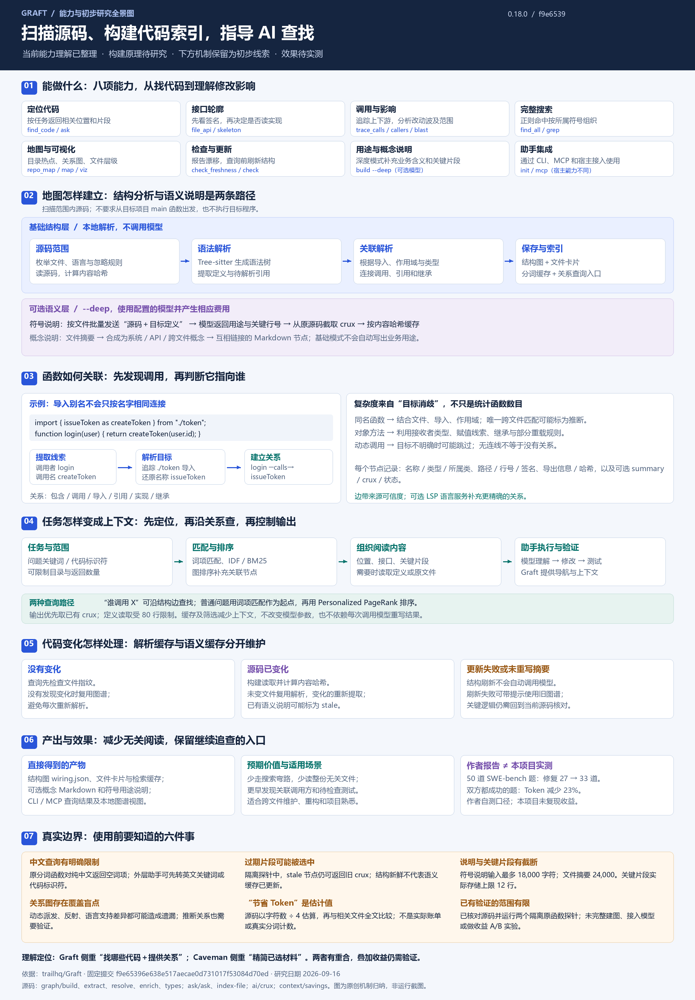
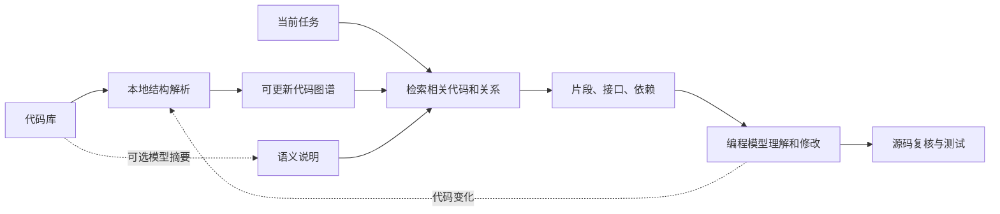

# 010 · Graft：代码库地图与按需上下文研究

**当前理解：Graft 对源码进行扫描并构建代码索引与关系图，指导 AI 查找相关代码。构建原理待研究。**

本阶段先记录它“扫描源码 → 构建索引 → 指导 AI 查找”的能力定位。减少无关阅读是预期效果，尚未实测。已有源码阅读、图示和隔离探针保留为研究线索，不代表已经研究清楚完整构建原理。

## 项目信息

| 项目 | 内容 |
| --- | --- |
| 上游 | [trailhq/Graft](https://github.com/trailhq/Graft) |
| 研究提交 | [f9e65396e638e517aecae0d731017f53084d70ed](https://github.com/trailhq/Graft/tree/f9e65396e638e517aecae0d731017f53084d70ed) |
| 包声明 | @nanonets/graft，0.18.0；不代表验证了 npm 发布物 |
| 许可 / 环境 | MIT；Node.js ≥20，依据上游 package.json |
| 研究日期 | 2026-09-16 |
| 状态 | 能力理解已整理；构建原理待研究，效果待实测 |

## 能力与产物

### 能力全景与初步研究线索

[高清 PNG（2600 × 3740）](assets/graft-overview.png) · [可缩放 SVG](assets/graft-overview.svg) · [图示依据与复现方式](assets/README.md)

全景图保留能力、函数关联示例、检索、缓存和效果边界等初步线索。构建原理仍待系统研究；作者基准数据、源码阅读和本地隔离探针分别标注，未做端到端收益实测。

研究材料：[源码阅读笔记（初步）](notes/implementation-audit.md) · [原函数探针结果](notes/source-probes.json)。包含数据结构、调用链和局部分支线索；纯中文分词、过期片段等观察仅限已记录的核对范围，未做完整上游运行。

[打开本地交互导读](web/dist/index.html) · [网页运行说明](web/README.md)

网页提供三个任务、依赖关系图、三种阅读深度、六步实现流程与缓存状态切换，同时解释 Graft 与 Caveman 的差别。内容为原创教学示例，未调用上游检索或模型；尚未发布到公共站点。

| 能力 | 产物 / 操作 | 用途 |
| --- | --- | --- |
| 代码结构梳理 | 函数、类、引用与调用关系 | 定位实现，理解代码连接 |
| 按问题查代码 | 排序后的相关节点、文件位置和代码片段 | 少读无关文件 |
| 查看接口 | 函数签名等接口轮廓 | 先了解如何调用，再决定是否看实现 |
| 追踪影响 | 上下游依赖与多层关系 | 重构时检查关联位置 |
| 语义说明（可选） | 模块概念、摘要及关键代码片段 | 补充“这部分为什么存在、在做什么” |
| 图谱查看 | 本地交互图和文件层级 | 供人浏览结构 |

基础结构解析不调用模型；深度语义说明需要配置模型。图谱可通过 CLI、MCP 被编程助手查询。[官方能力说明](https://github.com/trailhq/Graft/tree/f9e65396e638e517aecae0d731017f53084d70ed#readme)；源码依据见[机制笔记](notes/mechanism.md)。

## 怎样减少读取

图为机制归纳，非运行结果。通常节省来自三个环节：先定位相关位置、先返回局部内容、复用已经整理的结构。要验证复杂逻辑时，模型仍需读取完整源码。

例如“修改登录 Token 有效期”：图谱可以辅助寻找配置、签发函数、校验函数及调用方，模型再决定实际修改哪些地方。这里的文件和步骤是教学场景，不是已经运行的案例；静态关系也不能直接证明某个调用方一定会出错。

## 我们研究过类似库吗？

**有相关研究，其中 Caveman 最接近“减少模型输入”的目标；Serena 最接近代码导航能力，但目前找到的是指南内的介绍，不能称作独立实测。**

| 已有记录 | 与 Graft 的关系 | 本地证据强度 |
| --- | --- | --- |
| Caveman（0910 / 005） | 精简已选定的输入内容；Graft 主要决定该取哪些代码，并提供结构关系 | 独立研究、机制与图示已整理，未实测收益 |
| Serena（0827 指南） | 符号定位、引用查找、语义编辑，和 Graft 的代码导航部分相近 | 指南研究及本地资料收录；未找到独立对照实验 |
| Pi（0910 / 004） | Agent 运行、工具调用和会话上下文管理；与代码检索处于不同层 | 独立研究及教学演示，未运行上游 |
| EvoMap / Evolver（本仓库 007） | 复用执行经验和方法；Graft 主要提供当前代码事实 | 已有离线模块验证，整体收益待测 |

逐项路径、证据及区别见[历史研究对照](notes/related-research.md)。此次可访问记录中未找到 GitNexus、Repomix 的独立研究证据，不能据此断言所有历史任务都没有讨论过。

## 效果应如何判断

作者给出了效率和任务正确率的自测结果，但本研究没有复现，不把宣传数字当作本项目收益。建议后续用同一仓库、同一模型和任务集，对照原有工作方式、Graft 基础图谱、Graft 深度说明三组，记录任务完成质量、输入与输出 Token、工具轮次、耗时及建图费用。

首次建图与后续复用要分别计费。对于一次性小任务，准备图谱的投入可能抵消检索收益；复杂跨文件维护更值得测。以上为研究判断。

## 边界与下一步

- 自动刷新主要维护结构层，不自动调用模型重写全部深度摘要；变化后的语义说明可能标记过期。
- 刷新失败存在使用旧图谱并返回提示的降级路径，因此不能说任何时候都绝无陈旧信息。
- 静态关系存在解析覆盖限制；“查到的依赖”不能替代完整回归测试。
- 当前完成：能力理解整理、初步源码阅读、历史研究检索、总索引登记、图示与交互网页。
- 构建原理待研究：扫描范围如何确定、函数定义如何提取、跨文件关联如何建立、动态调用如何处理，以及修改后如何更新索引。
- 待验证：用小型真实仓库跑通建图、检索和刷新，再做真实任务对照实验。

详见[机制与验证边界](notes/mechanism.md)和[来源记录](notes/sources.md)。

---

[返回总索引](../../README.md)
