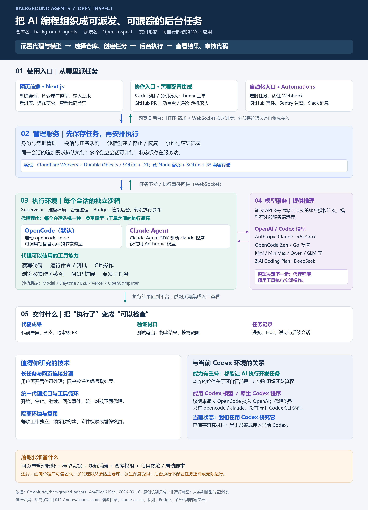
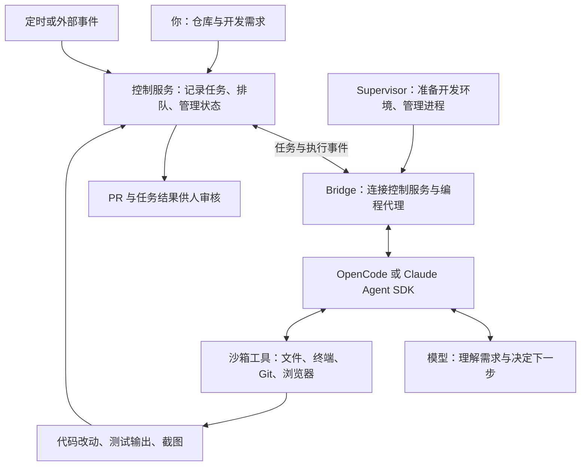

# 011 · Background Agents：后台 AI 编程平台能力研究

**这个项目让你搭建一个“给 AI 派开发任务”的平台：选择代码仓库，描述需求，AI 在独立开发环境中修改代码、运行命令，按要求提交 PR，供你审核。任务可以在你关闭网页后继续执行。**

仓库名是 `background-agents`；作者在 README 中把系统称作 **Open-Inspect**。这是同一个项目的两种名称。[名称依据](notes/sources.md#s01)

**先读：[我们的理解汇总](notes/understanding.md)**。从“网页控制、服务端执行”出发，统一解释能力、入口、前后端交互、代理软件与模型 API、Codex 关系，以及值得借鉴的技术。

## 中文交互网页

[打开在线研究网页](https://yydshly.github.io/0914_codex_project/011-background-agents/) · [总览图](https://yydshly.github.io/0914_codex_project/011-background-agents/#overview) · [总导航](https://yydshly.github.io/0914_codex_project/)

网页以“网页派任务，服务端 Agent 干活”为主线，汇总能力与入口、四步执行流程、代理与模型接入、前后端实现、Codex 关系及总览图。

在仓库根目录执行：

```powershell
python projects/011-background-agents/src/build_site.py
python -m http.server 8097 --bind 127.0.0.1 --directory projects/011-background-agents/web/dist
```

打开 [本地研究网页](http://127.0.0.1:8097/)。这是教学导读，尚未连接真实 Agent；也可以直接打开构建后的 `web/dist/index.html`。见 [网页说明](web/README.md) 与 [网页验证记录](notes/web-verification.md)。

## 一张图理解能力、原理与实现



[高清 PNG（2400 × 3320）](assets/background-agents-overview.png) · [可缩放 SVG](assets/background-agents-overview.svg) · [图示依据与生成说明](assets/README.md)

从上往下看任务流程；右侧区分“代理程序”与“模型服务”。图中特别说明：该版本能通过 OpenCode 使用 OpenAI/Codex 模型，但没有原生 Codex CLI 代理适配。图为源码与文档归纳，尚未部署验证。

| 项目 | 内容 |
| --- | --- |
| 上游 | [ColeMurray/background-agents](https://github.com/ColeMurray/background-agents) |
| 研究提交 | [4c470da615eaecbf8f64b0ae5a04666c99b4c536](https://github.com/ColeMurray/background-agents/tree/4c470da615eaecbf8f64b0ae5a04666c99b4c536) |
| 许可证 | MIT；Open-Inspect Contributors |
| 研究日期 | 2026-09-16 |
| 本次成果 | 中文交互网页、能力与架构总览图、关键源码核对、部署要求、验证方案及固定版本证据索引 |
| 验证范围 | 静态阅读；尚未部署平台、连接模型、运行沙箱或创建真实 PR |

## 从一个实际需求理解它

假设你已经有一个商城网站，要增加“订单导出 CSV”。下面是教学场景，不是本次执行结果。

| 阶段 | 你提供什么 | 系统执行什么 | 你得到什么 |
| --- | --- | --- | --- |
| 准备 | 代码仓库、运行方法、模型与沙箱配置 | 建立可供 AI 工作的环境 | 一个能收任务的平台 |
| 派任务 | “增加订单导出 CSV；保持现有权限；补测试并提交 PR” | 保存任务，分配开发环境，获取代码 | 可查看的会话与执行进度 |
| 开发 | 必要时补充字段、格式、验收要求 | 代理阅读代码、修改文件、执行测试；可使用浏览器检查界面 | 代码差异、命令输出、必要的截图 |
| 交付 | 要求提交审核 | 推送分支并调用代码托管服务创建 PR | 一个待审核的代码修改 |
| 后续 | “金额保留两位小数” | 在会话中继续排队执行后续要求 | 新一轮结果和代码改动 |

平台提供这些执行条件；某次功能是否正确完成，需要检查实际改动和测试结果。任务流程依据见 [S02](notes/sources.md#s02)、[S03](notes/sources.md#s03)、[S08](notes/sources.md#s08)。

## 核心能力

| 能力 | 可以怎样用 | 关键边界 |
| --- | --- | --- |
| 后台开发 | 下班前派发修复任务，稍后查看结果 | 服务端与沙箱仍需运行；存在超时和预算限制 |
| 独立开发环境 | 拉代码、装依赖、执行构建和测试 | 项目运行依赖需事先配置，Linux 环境不等于你的本地电脑 |
| 浏览器与人工介入 | 查看网页、截图；通过终端或可选 VS Code 检查工作区 | 浏览器工具的存在不代表每个任务都自动做完整视觉验收 |
| 多入口 | 网页发任务，在 Slack 或 GitHub PR 中发起工作，关联 Linear 工单 | 各入口需单独配置集成与身份 |
| 多人参与 | 同事共享一个任务，查看进度并追加要求 | 同一会话的 prompt 按队列执行 |
| 并行子任务 | 主代理把同一仓库中的独立工作交给子代理 | 各自拥有沙箱；有限制；不会自然变成已经合并的最终代码 |
| 多仓库会话 | 前端与 API 仓库一起修改，每个仓库分别提交 PR | 最多 10 个仓库；不同于多个子会话 |
| 自动化 | 定时维护；CI 失败或 Sentry 告警触发排查 | 需要设置触发条件；分析质量与修复成功率未实测 |
| 技能复用 | 把团队的测试、审核和项目约定配置为可复用指令 | 指令不是权限隔离机制 |
| 环境恢复 | 后续工作复用文件、依赖或暂停的沙箱 | 恢复方式取决于供应商，不能把文件快照等同于任意进程恢复 |

功能依据：[项目说明](notes/sources.md#s01)、[运行机制](notes/sources.md#s02)、[自动化](notes/sources.md#s09)、[技能](notes/sources.md#s17)。逐项输入、输出与限制见 [能力矩阵](notes/capabilities.md)。

## 技术上如何实现



**模型决定怎么做，代理运行层执行工具调用，沙箱提供实际工作环境，平台负责安排与记录工作。** 这几个部分需要共同配置。图为源码归纳，不是运行截图。

源码中，控制服务先保存任务，再寻找可用沙箱；同一会话有正在执行的任务时暂不分发下一条。Bridge 把模型和工具事件传回来，并明确让正在执行的 prompt 跨 WebSocket 断开继续存活。详细调用链见 [实现原理](notes/architecture.md)。

## 本次研究发现的几个重要区别

1. **仓库名与产品名不同。** 文档中的 Open-Inspect 就是此仓库提供的系统，根 `package.json` 的名称也是 `open-inspect`。[S01](notes/sources.md#s01)、[S19](notes/sources.md#s19)
2. **多仓库、子代理、定时批处理是三种组织方式。** 多仓库会话在一个沙箱里协同修改；子会话在独立沙箱内并行；定时多仓库任务则按仓库分发独立会话。[S02](notes/sources.md#s02)、[S07](notes/sources.md#s07)、[S09](notes/sources.md#s09)
3. **子会话被约束在父会话的主仓库内。** 当前代码将子会话设计为单仓库，并设置最大派生深度 2；不能把它理解为任意跨仓库的无限代理团队。[S07](notes/sources.md#s07)
4. **控制服务可自部署，但任务仍需沙箱后端。** Node 容器部署方案不代表已有“全本地 Docker 运行所有开发任务”的后端；当前供应商工厂列出五种接入。[S10](notes/sources.md#s10)、[S11](notes/sources.md#s11)
5. **支持 Linear 工单交互，不等于已实现 Linear Event 自动化。** 后者在该版本自动化文档中仍标为 Planned。[S09](notes/sources.md#s09)
6. **PR 作者不总是发任务的人。** 当前代码优先使用用户认证，没有时回退 App 身份创建；源码中的旧注释和部分说明仍提到手动 PR 链接，研究记录以实际执行分支为依据。[S08](notes/sources.md#s08)

## 什么情况下有价值

研究判断：当你有可复现的代码环境，经常需要并行处理独立任务、通过工单或告警派发工作，并希望团队共享进度时，这类平台值得进一步验证。

如果只是偶尔修改一个小文件，平台的账号、沙箱、网络与运维准备会增加额外投入。开源许可证也不包含模型、沙箱和托管资源的免费使用额度。具体开销需实测记录，不在本研究中猜测金额。

## 部署与验证入口

- [部署条件与最小试用路线](notes/deployment.md)：需要哪些组件，怎样区分“网页打开了”和“真正完成任务”。
- [验证记录与后续实验](notes/verification.md)：已核对的范围，以及修复、断线、恢复、并行和事件触发的验收方式。
- [固定版本来源索引](notes/sources.md)：25 个文档或源码文件的定位链接。
- [机器可读证据](notes/evidence.json)：文件哈希、检索定位与研究版本。

当前状态设为“研究中”：能力与源码研究、中文交互导读已完成；端到端功能、成本、完成质量和故障恢复仍待连接真实服务验证。研究网页已通过 GitHub Pages 发布并验证，可在线或本地阅读；上游平台及真实 Agent 尚未部署。

---

[返回总索引](../../README.md)
