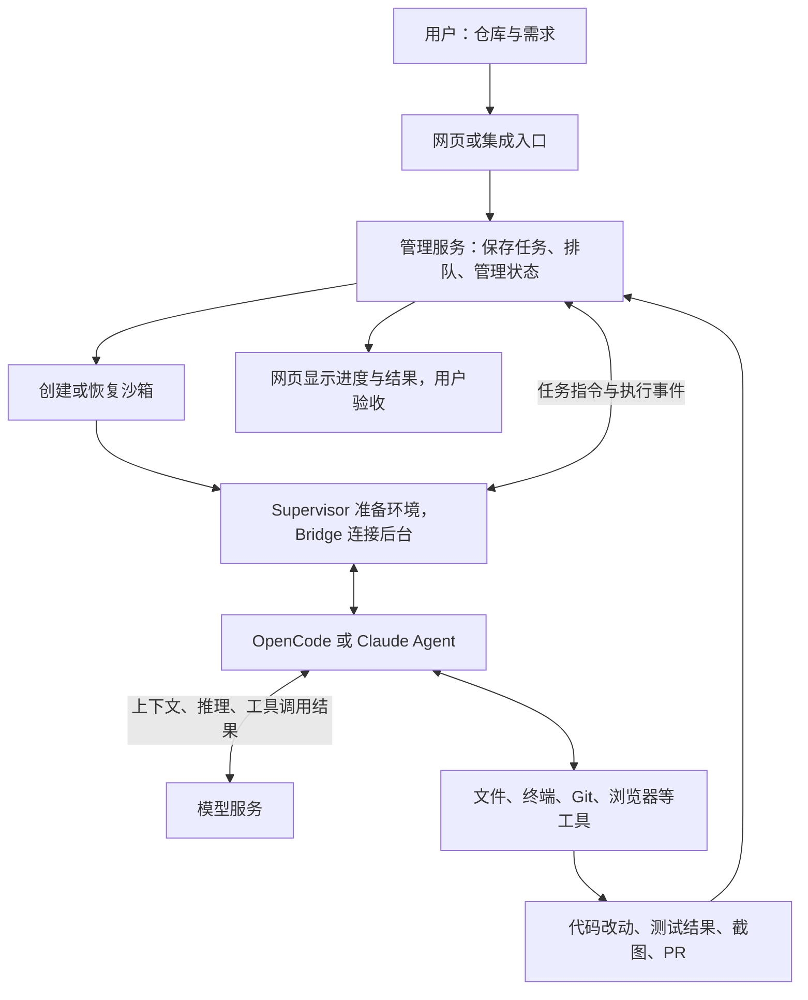

# 我们对 Background Agents 的理解

**它是一套可以自行部署的后台 AI 编程平台：网页用于配置、派任务和查看结果，服务端管理任务，沙箱中的 Agent 真正修改代码、运行命令并交付成果。**

研究日期：2026-09-16。以下结论固定于上游提交 `4c470da615eaecbf8f64b0ae5a04666c99b4c536`；来自文档与源码核对，尚未部署完整平台。

## 1. 它到底是什么，为什么叫 Open-Inspect？

`background-agents` 是 GitHub 仓库名，`Open-Inspect` 是作者给这套系统使用的名称。两者指向同一个项目。这个仓库提供可部署的应用及相关基础设施，主要面向软件开发任务。[S01](sources.md#s01)

从使用者角度，可以理解为“配置 AI，然后发布开发任务”。再准确一层：它把模型、编程代理、代码仓库和执行环境组织成一个可持续运行、可查看进度的平台。

例如，你在网页选择商城仓库，要求“增加订单 CSV 导出，保持权限规则，补测试并提交 PR”。平台准备开发环境，代理分析并修改代码、运行验证，最后给你代码差异、测试输出和待审核的 PR。这个例子用于说明流程，不是本次实际执行结果。

## 2. 网页、后台、Agent、模型分别做什么？

| 部分 | 通俗理解 | 实际责任 |
| --- | --- | --- |
| 网页前端 | 控制台 | 选择仓库与配置、提交要求、查看进度、结果和产物 |
| 后台管理服务 | 任务管理员 | 认证、保存会话、排队、分发任务、管理沙箱、记录事件 |
| 编程代理程序 | 执行者 | 组织模型调用、执行工具、处理工具结果，持续推进任务 |
| 模型服务 | 推理能力 | 理解上下文、分析问题、决定下一步行动 |
| 沙箱 | 工作电脑 | 提供独立 Linux 环境、项目文件、终端、依赖、Git 和浏览器等工具 |

“服务端 Agent + 网页控制”抓住了主要形态。这里的服务端还包括管理服务和独立的执行沙箱；它们不必运行在同一台机器上。[S02](sources.md#s02)、[S03](sources.md#s03)、[S05](sources.md#s05)

## 3. 从哪里使用，能得到什么？

| 入口 | 怎么发起工作 |
| --- | --- |
| 网页 | 创建会话，选择仓库与模型，输入任务要求 |
| Slack | 与机器人私聊或提及机器人，在消息线程中继续沟通 |
| GitHub | 新 PR 自动审查，或在 PR 评论、行内评论中提及机器人 |
| Linear | 在工单中提及代理，或把工单分配给代理 |
| 自动化 / Webhook | 定时执行，或通过已配置的外部事件、认证请求触发 |

集成入口需要配置。普通 GitHub Issue 评论不走上述 PR 评论入口；Linear 工单交互和仍标为计划中的 Linear Event 自动化是不同能力。[S01](sources.md#s01)、[S09](sources.md#s09)

代理可以读取和修改代码、运行命令、安装依赖、构建、测试、使用浏览器与截图，并按要求推送分支和创建 PR。平台还提供任务队列、多人共享会话、独立子会话、多仓库工作和自动触发。[能力矩阵](capabilities.md)

这些能力提供完成任务的条件；某项需求是否真正完成，要看实际文件、测试与审核结果。

## 4. 本质上是客户端与服务端交互吗？

是。网页负责输入和展示，任务的生命周期属于服务端。完整流程是：

管理服务先保存任务，需要时启动沙箱，再向 Bridge 分发要求。Bridge 调用代理运行层，把文本、工具调用和完成事件传回控制服务。沙箱与控制服务之间使用 WebSocket；OpenCode 适配层通过 HTTP/SSE 与沙箱内的 OpenCode 服务通信。[S03](sources.md#s03)、[S04](sources.md#s04)、[S25](sources.md#s25)

关闭网页不会自然结束后台任务。同一会话中的后续要求按队列处理；不同子会话可在独立环境执行。断线继续运行并不保证沙箱崩溃或存储失效后也能无损恢复。[实现原理](architecture.md)

## 5. 服务端的 AI，是 API 还是软件？

**两层都有：沙箱中运行代理软件，代理再访问模型服务。**

| 代理运行方式 | 接入模型 | 配置方式与边界 |
| --- | --- | --- |
| OpenCode：启动 `opencode serve` | OpenAI、Anthropic、xAI、OpenCode Zen / Go、Z.AI Coding Plan、DeepSeek 等目录中支持的渠道 | 配置相应凭据；部分渠道支持项目定义的账号授权方式 |
| Claude Agent：由 Claude Agent SDK 驱动 `claude` 程序 | Anthropic | 使用 Anthropic API Key，或项目支持的 Claude 账号授权 |

选择代理程序是在选择“谁负责执行”；选择模型是在选择“它使用哪种推理服务”。OpenCode 的 Anthropic 路径使用 API Key；Claude 订阅账号授权属于 Claude Agent 路径。渠道支持范围、账号权限和实际可用性需要分别核实。[S06](sources.md#s06)、[S22](sources.md#s22)、[S23](sources.md#s23)、[S24](sources.md#s24)、[S25](sources.md#s25)

因此，服务端并非通过打开桌面聊天窗口、模拟输入来完成这些工作。平台使用程序接口、代理进程和工具调用组织任务。

## 6. 能接入 Codex 吗，和当前环境有什么关系？

- **Codex 模型**：该版本可通过 OpenCode 使用项目支持的 OpenAI / Codex 模型，配置 API Key 或支持的 ChatGPT 账号授权。[S22](sources.md#s22)、[S24](sources.md#s24)
- **Codex CLI 作为执行程序**：该版本只有 `opencode`、`claude` 两种代理标识，没有原生 Codex CLI 适配；要直接运行它，需要补充运行层适配与对应配置、事件处理。[S05](sources.md#s05)、[S06](sources.md#s06)
- **我们正在使用的 Codex 环境**：本次用它阅读源码、整理资料和制作研究网页。当前没有部署或连接 Open-Inspect，也没有让该库接管当前 Codex。

使用某个模型，与接入同名的 CLI 或桌面应用，是不同层次的接入。这个库对我们的价值主要在于研究可自部署的平台结构、团队入口和任务组织方式。

## 7. 前后端怎样实现？

| 层次 | 固定版本中的实现 |
| --- | --- |
| Web | Next.js |
| 默认管理服务 | Cloudflare Workers、会话 Durable Objects / SQLite、共享 D1 |
| 管理服务替代部署 | Node 容器、SQLite 持久目录、S3 兼容对象存储；当前依赖单实例假设 |
| 沙箱内协调 | Supervisor 准备环境和管理进程，Bridge 转发任务及执行事件 |
| 代理适配 | OpenCode / Claude Agent SDK |
| 沙箱后端 | Modal、Daytona、E2B、Vercel、OpenComputer |

管理服务支持容器部署，不意味着开发任务已经支持全本地 Docker 沙箱。Web 与沙箱后端仍需分别准备；具体组件和连通性要求见 [部署说明](deployment.md)。[S10](sources.md#s10)、[S11](sources.md#s11)

## 8. 对我们有价值的技术点

以下是结合研究形成的工程判断：

1. **把任务管理和执行拆开。** 网页提交后不必一直等待，后台保存任务，由独立执行环境处理。可以借鉴到资料分析、报告生成等长任务。
2. **保存队列、状态和事件。** 用户刷新页面仍能找到工作进度；后续要求有顺序，执行过程可追踪。实际设计仍需处理重试、重复执行和故障恢复。
3. **用统一接口适配代理。** 上层管理平台通过统一入口启动、继续、停止工作并接收事件，降低更换执行程序时的改造范围。
4. **用隔离环境控制依赖和工作区。** 独立任务不共用一套随意变化的项目文件；预构建、快照或持久沙箱恢复可减少重复准备。
5. **把集成事件转成标准任务。** 网页、机器人、定时计划和 Webhook 可以复用后续的排队、执行和记录流程。

这些技术点的价值在于组织可靠的执行系统。是否适合我们的实际项目，需要用同一任务的效果、成本和维护投入来验证。

## 9. 已确认与待验证

已完成文档与关键源码核对、25 项固定版本来源、能力总览图、中文交互导读及其本地浏览器检查。

尚未启动完整平台、连接模型与云沙箱、执行真实开发任务或创建 PR；没有测量完成率、成本和故障恢复效果。下一步应先用一个小型测试仓库跑通“发任务 → 改文件 → 运行测试 → 交付 PR”，再验证断线、恢复、并行和事件触发。[验证方案](verification.md)

---

[返回项目说明](../README.md) · [网页使用说明](../web/README.md) · [总览图](../assets/background-agents-overview.png) · [来源索引](sources.md)
