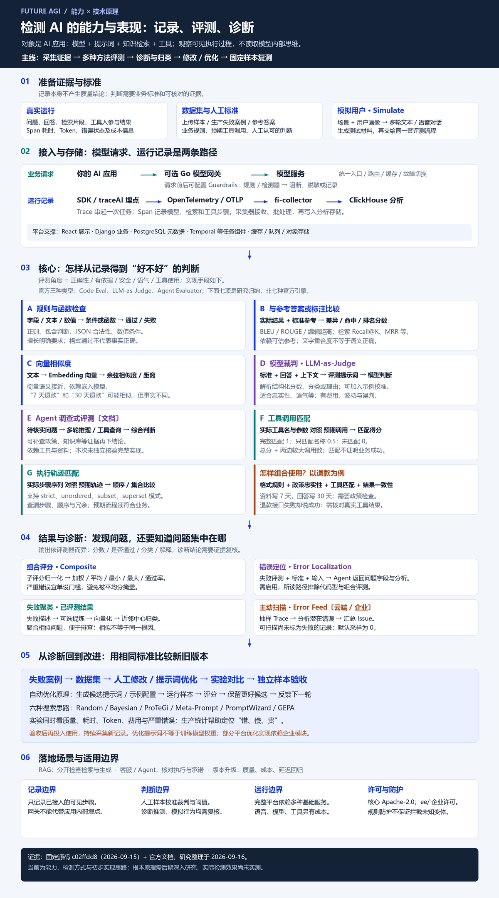
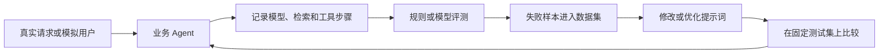

# 012 · Future AGI：AI 应用评测与持续改进研究

**Future AGI 的核心能力是检测和评估 AI 应用在具体任务中的能力与表现。** 它记录回答、检索和工具执行过程，再通过规则检查、参考答案比较、向量相似度、模型裁判、Agent 调查、工具调用及轨迹匹配进行检测，帮助发现问题、比较版本并验证改进。

**研究进度：当前整理了能力、检测方式和初步实现思路；底层判分、错误诊断与优化算法的根本原理仍需后期深入研究，实际效果待实测。** 已阅读关键源码不等于已完整研究原理或验证可靠性。

| 项目 | 内容 |
| --- | --- |
| 上游 | [future-agi/future-agi](https://github.com/future-agi/future-agi) |
| 固定研究提交 | [c02ffdd8d0575cba4ab07743f67b508bd20206c0](https://github.com/future-agi/future-agi/tree/c02ffdd8d0575cba4ab07743f67b508bd20206c0) |
| 上游提交时间 | 2026-09-15 12:06:21 UTC |
| 研究日期 | 2026-09-16 |
| 状态 | 研究中；已完成首轮文档与关键源码静态核对 |
| 许可结构 | 开源核心 Apache-2.0；ee/ 目录另有企业许可 |
| 本次成果 | 中文研究网页、技术原理总览图、七类分析手段、诊断与优化机制、部署边界、固定版本来源及 10 个合成场景 |
| 验证范围 | 未部署平台、调用模型、运行语音模拟或测量优化收益；代码路径存在不等于效果已验证 |

## 阅读入口

- [在线研究网页](https://yydshly.github.io/0914_codex_project/012-future-agi/)：已发布并验证，说明检测能力、检测方式与后续研究范围。

- [中文研究网页](http://127.0.0.1:8098/)：能力展开、评测方式与业务场景切换；需本地服务运行。也可打开 [离线网页](web/dist/index.html)。
- [网页运行与维护说明](web/README.md)
- [一张图看懂技术原理](assets/future-agi-technical-overview.png) / [可缩放 SVG](assets/future-agi-technical-overview.svg)
- [分析手段、错误诊断与改进验证](notes/analysis-methods.md)
- [我们的理解与后续研究重点](notes/understanding.md)
- [能力、输入输出与使用场景](notes/capabilities.md)
- [架构与关键实现](notes/architecture.md)
- [自部署条件、开源边界与当前疑点](notes/deployment-and-boundaries.md)
- [实验设计与本次核验记录](notes/verification.md)
- [固定版本来源索引](notes/sources.md)
- [合成业务测试场景](src/scenarios.json)

## 核心能力



**“评什么”和“怎么评”是两层。** 正确性、安全性、语气等是角度；规则、参考比较、向量相似度、模型裁判、Agent 调查、工具和轨迹匹配是分析手段。记录为判断提供证据，诊断帮助归纳问题，再用固定样本验证改进；并非读取模型内部思维或自动训练模型权重。

| 能力 | 用户得到什么 | 使用价值 |
| --- | --- | --- |
| Observe 追踪 | 模型、检索、工具的步骤记录及耗时、成本信息 | 定位回答为什么错、慢或贵 |
| Evaluate 评测 | 分数、通过/失败、解释或分类 | 将业务要求转换为可重复的检查 |
| Simulate 模拟 | 按场景和用户画像生成多轮对话及评测结果 | 提前发现异常流程与边界问题 |
| Dataset / Experiments | 在同一批样本上比较版本 | 判断一次修改是否产生退步 |
| Optimize 优化 | 根据评分搜索提示词或示例配置 | 减少手工试验；平台部分实现依赖企业模块 |
| Gateway 网关 | 统一模型入口、路由、故障切换、缓存和成本控制 | 集中管理模型服务 |
| Guardrails 防护 | 检查输入输出并按策略处理 | 对已定义风险执行阻止、脱敏、告警或记录 |

逐项依据及限制见[能力矩阵](notes/capabilities.md)。产品文档、源码实现、实际验证在本项目中分别标注。

## 从一个需求理解它

假设你开发退款客服。你提供退款政策、测试订单和用户问题；Agent 查询订单并决定是否退款。Future AGI 可以记录工具调用、对照政策评分，模拟“订单号缺失”“退款条件不满足”“接口失败”等对话，并比较修改前后的表现。

示例标准：“只有退款工具返回成功，才可确认退款成功。”应结合工具结果检查，不能仅凭回答语气评分。这是研究者设计的方案，尚未运行真实退款流程。



## 首轮结论

1. **平台与 SDK 可以分别研究。** 完整系统有多种基础服务，可先选择追踪或评测接入，不必立即部署全部模块。[S01、S06、S08](notes/sources.md)
2. **评测不只有模型打分。** 已核对函数型评测器和模型评测器；文档另有可调用工具调查的 Agent Evaluator。[S16、S17、D02](notes/sources.md)
3. **自动优化主要作用于提示词和示例配置。** 不能解释为自动训练基础模型，也不能直接推导业务收益。[D06、D07](notes/sources.md)
4. **开源范围需逐项核实。** 平台优化入口导入 ee.agenthub，六种优化器目录位于 futureagi/ee/agent_opt/optimizers/。独立 SDK 的许可不能替代平台企业目录的许可。[S03、S13、S21、S22、T01](notes/sources.md)
5. **防护有具体覆盖范围。** 所读内置注入检测器处理用户消息并作规则匹配，不能据此认为覆盖所有语言和攻击路径。[S11、S12](notes/sources.md)
6. **说明存在更新不同步。** 服务数量、Protect 套餐与本地网关规则、自部署与联网遥测，需要按具体对象核验。[部署边界](notes/deployment-and-boundaries.md)

## 复核本地研究材料

在总仓库根目录执行以下命令，只下载选定提交的 24 个公开文件供阅读，不启动平台或执行上游代码：

```powershell
python projects/012-future-agi/src/fetch_sources.py
python scripts/catalog.py check
```

下载进入本子项目忽略提交的 .cache/upstream/；[清单](notes/source-manifest.json)保存固定链接、字节数和 SHA-256。LICENSE、LICENSE-EE、NOTICE 随阅读材料一并保留；上游代码未复制进正式研究文档。需要联网访问 GitHub，无第三方 Python 依赖。

下一轮按照[验证方案](notes/verification.md)验证“追踪 → 数据集 → 评测”的最小流程，再扩展模拟和优化。

---

[返回总索引](../../README.md)
