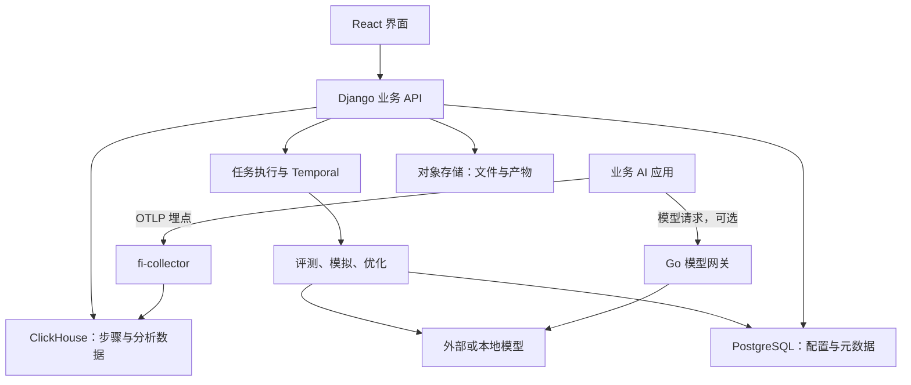

# 架构与关键实现

研究阶段：以下为初步实现思路，帮助理解检测能力怎样组织；底层判分、诊断和优化算法的根本原理仍需后期深入研究。

版本：c02ffdd8d0575cba4ab07743f67b508bd20206c0。以下为静态阅读归纳，非部署结果。编号见[来源索引](sources.md)。

图省略缓存、消息队列和属性目录支撑组件。网关请求与追踪事件是不同路径；网关不会自动记录应用内部所有检索和工具步骤，后者需埋点。依据 S06、S08、D01、D05。

## 追踪：采集器直接写分析存储

fi-collector README 描述：SDK 发送 OTLP → 接收、内存限制、批处理 → 自定义 exporter → ClickHouse。采集时拆分属性类型，不再经过旧 PostgreSQL/CDC Span 写入链。PostgreSQL 仍承担业务存储，但不能画成所有追踪都先写 PostgreSQL。部分安装说明概括与该具体路径不同，本研究优先采用采集器描述。S08。

## 评测：模板、执行器和结果

FunctionEvaluator 确认函数名属于 operations，调用相应函数，并封装分值、解释、耗时、failure。该类不指定模型；它证明存在直接计算的评测，不代表所有代码评测都经过同一沙箱。S16。

CustomPromptEvaluator 接收规则、模型、输出类型，校验输入并渲染模板，组织模型消息和处理结果。含上下文窗口处理与结构化输出约束。同样的规则仍可能得到波动判断，因此要同时保存规则和评测模型版本。S17。

Agent Evaluator 文档允许通过工具和知识库多轮判断；本轮未独立核验完整执行链。D02。

## 模拟：场景驱动的会话

ChatServiceBlueprint 定义创建助手、会话、收发消息与获取历史等接口。prompt_based_agent_adapter 将提示词版本、变量和模型配置适配为被测 Agent。S18、S23。

chat_sim 后台任务保存消息、管理状态，在对话完成后派发评测。所读提示词模拟任务先发起会话，再执行对话循环，传入 max_turns=10；该值仅对应这个入口。S19。

所以核心输入是“被测 Agent + 场景 + 画像 + 评测标准”。输出先是过程记录，再是依据记录作出的判断。

## 优化：依据评分搜索候选

服务层创建运行配置，后台任务执行并记录过程。算法按官方文档区分：随机搜索试措辞变化；贝叶斯搜索选择示例和配置；ProTeGi 依据文字反馈维护多个候选；Meta-Prompt 迭代单一候选；PromptWizard 变异并批评改写；GEPA 利用反思开展跨代搜索。D06、D07。

平台六种优化器目录位于 ee/agent_opt/optimizers/，已读入口导入企业模块或回退到功能缺失 stub。因此应分别判断产品能力与特定部署的许可、依赖和可用性。S14、S15、S21、S22、T01。

优化分数上升只代表所选评测中的表现提升。需要未参与搜索的留出样本，检查是否只是迎合训练案例或裁判。

## 网关与防护：配置驱动执行

Router 创建策略并按模型选择目标，管理健康状态、排除目标与延迟信息。完整重试、缓存逻辑还在其他模块，不将单个文件等同全部网关。S09、S10。

guardrails.Engine 将 pre/post 检查分开，配置同步/异步模式、动作、阈值、超时及策略覆盖。异步检查与同步阻断需要分别验收。S11。

所读 injection.go 仅提取 user 消息文本，匹配模式并按计数加权生成分数；引擎再结合策略处理。不能从规则数量推断对中文、间接注入和未知变体的覆盖；外部检测服务适配器属于其他路径。S12。

## 可借鉴设计

1. 保存业务过程和最终回答，以便定位失败。
2. 在生产记录与回归数据上复用评测定义。
3. 将模拟、保存、评分与优化组织为可追踪的异步工作。
4. 用明确输入、评分规则和验收条件定义质量目标。
5. 分别验收接口、许可、依赖完整性与实际效果。
