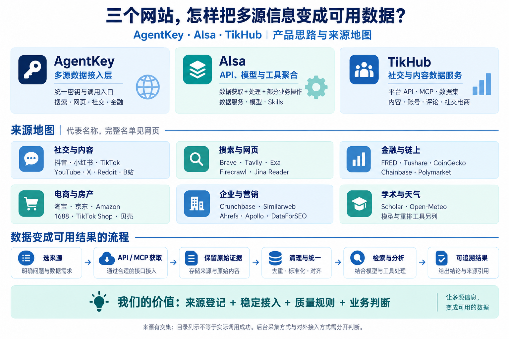
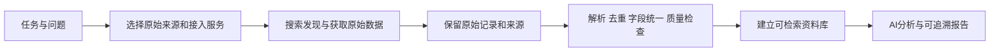

# 013 · AgentKey / AIsa / TikHub：数据来源与处理能力研究

**研究主线：数据从哪里来，怎样拿到，平台已经处理到哪一步，剩下哪些清理工作需要我们完成。**

**摘要：** AgentKey 侧重多源数据接入，AIsa 聚合 API、模型与工具，TikHub 侧重社交内容数据。来源设置是起点；对我们的意义在于建立可替换的接入、跨源质量规则和可追溯结果。本研究整理 148 条来源、服务与能力，区分已列接口、来源宣称和规划项目；业务接口尚未实测。

[完整研究摘要](notes/research-summary.md) · [下载引导图](assets/agent-data-sources-guide.png)

“来源 + 后续清理”适合作为我们的项目划分；理解这三家商业服务时，还要补上获取稳定性、权限、检索和统一交付。它们并不都提供完整的数据清洗流水线。AgentKey 侧重多源接入；TikHub 侧重社交数据获取；AIsa 还包含模型、处理工具和业务操作。[官方证据](notes/sources.md)

## 直接阅读

**网页阅读：** [本地研究网页](http://127.0.0.1:8130/#overview) · [网页运行与维护说明](web/README.md)。提供研究导读、引导图、分类名录、来源筛选、三家对比、九类数据清理规则和证据入口。已接入仓库统一 GitHub Pages 发布流程，正式地址待发布验证后登记。

| 文件 | 解决的问题 |
| --- | --- |
| [来源与服务总表](notes/sources-inventory.md) | 每个名称是什么、哪家列出、证据在哪、是否只是规划 |
| [获取方式与不确定项](notes/access-methods.md) | API / MCP / RSS、数据集与扩展分别如何使用；逐来源记录权限和未知项 |
| [产品思路与能力对比](notes/capabilities.md) | 三家分别替客户解决哪一层问题，搜索和清理有什么区别 |
| [数据清理与后续处理](notes/data-cleaning.md) | 平台已做什么，我们还需做什么，如何验证清理效果 |
| [官方证据与核查边界](notes/sources.md) | 文档链接、冲突项、未实测范围 |
| [结构化来源登记](notes/source-inventory.json) | 后续接入程序或扩充资料库所用的数据 |

## 本轮整理结果

查阅日期：2026-09-16。共核查 **25 个公开页面**，形成 **148 条去重后的来源、服务或能力登记**；初轮 19 页，获取方式研究补充 6 页。这是混合类型目录，不能解释为 148 个独立原始数据源，也不能解释为已验证可用的接口。FRED 页面通过网页阅读工具核查，本地快照请求超时，已保留该差异。

| 平台 | 本次目录范围 | 如何理解 |
| --- | --- | --- |
| AgentKey | 51 个具名来源、服务或能力标签 | 首页 46 项，另从链上文档补入 Chainbase、Polymarket、Kalshi、ENS、Space ID；含供应商未披露的能力分类 |
| AIsa | 31 个有链接的 API 家族；80 个 Coming Soon 名称；另记官网提及的 TikTok Shop | API 家族不等于数据源；Semrush 同时有接口和 Coming Soon，保留冲突；模型和邮件操作单列 |
| TikHub | 文档中 19 个内容平台，加 TikTok Shop 电商子产品 | 以实际导航逐名登记，不强行套用官网“16 平台”的宣传口径 |

三家有重叠，不能直接相加。所有条目均标记 `tested: false`；没有购买、接入或调用付费数据。

获取方式的明确程度独立统计：**46 条已有来源级接口目录、26 条仅确认统一入口或来源宣称、1 条上线状态冲突、75 条仅规划**。网页优先显示接口明确的条目。“接口文档明确”“后台采集机制披露”“实际调用成功”是三个独立维度。

## 来源快速地图

| 类别 | 已在公开资料中找到的代表名称 | 需要分清的事情 |
| --- | --- | --- |
| 社交与内容 | X、Reddit、YouTube、TikTok、抖音、小红书、B站、微信、微博、Instagram、知乎、快手等 | 内容在哪个平台产生；实际接口供应商未必是该平台 |
| 搜索与网页 | Brave、Tavily、Serper、Exa、Parallel、Perplexity、Firecrawl、Jina Reader、Bright Data、BytePlus | 搜索服务、回答服务、正文提取不是同一种能力 |
| 金融与链上 | Tushare、Yahoo Finance、FRED、Finnhub、Alpha Vantage、Chainbase、CoinGecko、Polymarket、Kalshi、EDINET | 行情、宏观、链上、预测市场需分别处理 |
| 电商与房产 | 淘宝、京东、Amazon、1688、抖音电商、TikTok Shop、贝壳 | 商品、SKU、地区、币种与时间快照决定可比性 |
| 企业与营销 | Crunchbase、Similarweb、Ahrefs、Semrush、DataForSEO、Apollo、WaveInflu、CNPJá | 流量估算、注册信息、联系方式与原始交易记录的性质不同 |
| 学术、天气 | Scholar、Open-Meteo | Scholar 是接口分类，不据此推断底层学术数据库 |
| 后续工具 | Jina Embeddings & Rerank、Matching Markets、Chat、AgentMail | 向量化、匹配、生成与邮件操作不是新增事实来源 |

各家的覆盖状态和完整名单请看[总表](notes/sources-inventory.md)，此处代表名称不表示三家全部支持。

## 我们应如何使用这份研究

这是建议的自建工作流程，不是三家都已实现的产品流程。原始记录应先留存，清洗产物与 AI 推断分别保存。

我们的可复用成果可以分为两部分：**来源登记表**记录去哪查、通过谁查、能查到什么、有什么限制；**处理规则**负责将不同返回结果整理为可比较、可检索、可追溯的数据。只有填来源名称，无法替代接口接入和数据质量工作。

## 研究边界与复核

- 三家为商业服务，本次不是开源库复现；总索引的上游地址暂用 AgentKey 文档作为首入口，另两家见下方。
- 当前完成的是公开目录整理与产品分析；账号权限、成功率、字段完整度、延迟和实际成本尚未测量。
- AIsa 规划项目、Semrush 状态冲突、TikHub 平台计数与账号权限差异已单列。
- `.cache/` 保存公开页面快照且不进入提交；[来源清单](notes/source-manifest.json)保留日期、URL 和 SHA-256，正式笔记仅作摘要。
- 更新时先运行 `python projects/013-agent-data-sources/src/fetch_sources.py`，人工复核变化，再运行 `python projects/013-agent-data-sources/src/build_inventory.py`。
- 总索引使用 `python scripts/catalog.py check` 检查；本研究不需要运行上游服务。

官网：[AgentKey](https://agentkey.app/) · [AIsa](https://aisa.one/) · [TikHub](https://tikhub.io/)

---

[返回总索引](../../README.md)
